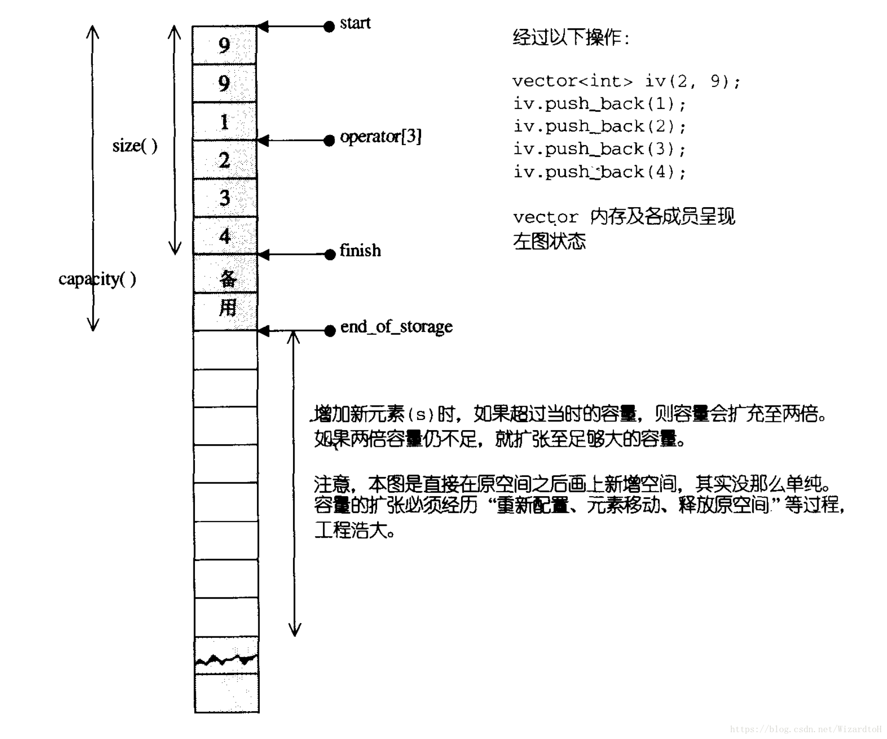
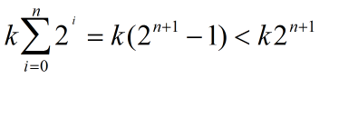
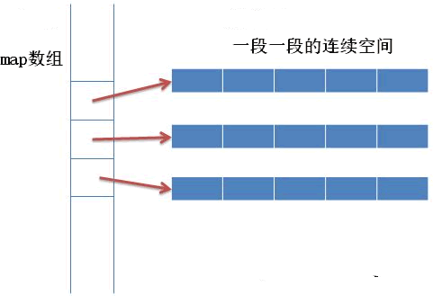
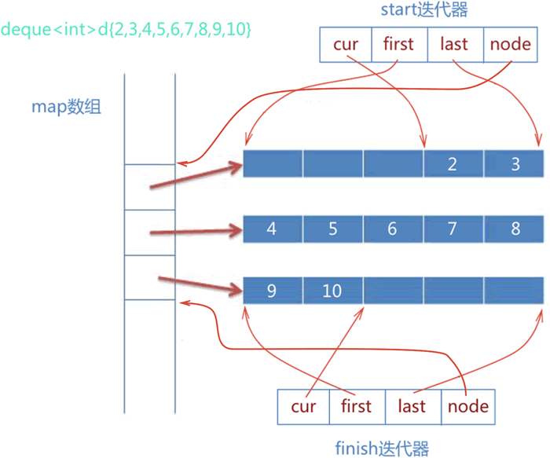
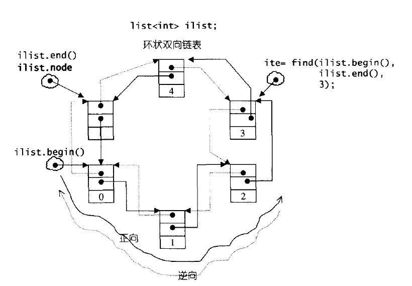
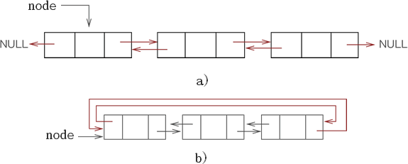
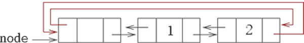

标准库，容器，仿函数，适配器，迭代器，算法，分配器

# 标准库中有哪些容器？分别有什么特点？

标准库中的容器主要分为三类：顺序容器、关联容器、容器适配器。

- 顺序容器包括五种类型：
	- `array<T, N>`数组：固定大小数组，支持快速随机访问，但不能插入或删除元素；
	- `vector<T>`动态数组：支持快速随机访问，尾位插入和删除的速度很快；
	- `deque<T>`双向队列：支持快速随机访问，首尾位置插入和删除的速度很快；（可以看作是`vector`的增强版，与`vector`相比，可以快速地在首位插入和删除元素）
	- `list<T>`双向链表：只支持双向顺序访问，任何位置插入和删除的速度都很快；
	- `forward_list<T>`单向链表：只支持单向顺序访问，任何位置插入和删除的速度都很快。
- 关联容器包含两种类型：
	- map容器：
	- `map<K, T>`关联数组：用于保存关键字-值对；
	- `multimap<K, T>`：关键字可重复出现的`map`；
	- `unordered_map<K, T>`：用哈希函数组织的`map`；
	- `unordered_multimap<K, T>`：关键词可重复出现的`unordered_map`；
	- set容器：
	- `set<T>`：只保存关键字；
	- `multiset<T>`：关键字可重复出现的`set`；
	- `unordered_set<T>`：用哈希函数组织的`set`；
	- `unordered_multiset<T>`：关键词可重复出现的`unordered_set`；
- 容器适配器包含三种类型：
	- `stack<T>`栈、`queue<T>`队列、`priority_queue<T>`优先队列。

# vector的底层原理及其相关面试题

## （1）vector的底层原理

vector底层是一个动态数组，包含三个迭代器，start和finish之间是已经被使用的空间范围，end_of_storage是整块连续空间包括备用空间的尾部。

当空间不够装下数据（vec.push_back(val)）时，会自动申请另一片更大的空间（1.5倍或者2倍），然后把原来的数据拷贝到新的内存空间，接着释放原来的那片空间【vector内存增长机制】。

当释放或者删除（vec.clear()）里面的数据时，其存储空间不释放，仅仅是清空了里面的数据。

因此，对vector的任何操作一旦引起了空间的重新配置，指向原vector的所有迭代器会都失效了。



## （2）vector中的reserve和resize的区别

reserve是直接扩充到已经确定的大小，可以减少多次开辟、释放空间的问题（优化push_back），就可以提高效率，其次还可以减少多次要拷贝数据的问题。reserve只是保证vector中的空间大小（capacity）最少达到参数所指定的大小n。**reserve()只有一个参数。**

resize()可以改变有效空间的大小，也有改变默认值的功能。capacity的大小也会随着改变。resize()可以有多个参数。

首先，`vector`的容量`capacity()`是指在不分配更多内存的情况下可以保存的最多元素个数，而`vector`的大小`size()`是指实际包含的元素个数；

其次，`vector`的`reserve(n)`方法只改变`vector`的容量，如果当前容量小于`n`，则重新分配内存空间，调整容量为`n`；如果当前容量大于等于`n`，则无操作；

最后，`vector`的`resize(n)`方法改变`vector`的大小，如果当前容量小于`n`，则调整容量为`n`，同时将其全部元素填充为初始值；如果当前容量大于等于`n`，则不调整容量，只将其前`n`个元素填充为初始值。

`vector`的`resize(n,m)`方法改变`vector`的大小，如果当前容量小于`n`，则调整容量为`n`，同时将其全部元素填充为m；如果当前容量大于等于`n`，则不调整容量，只将其前`n`个元素填充为初始值。

## （3）vector中的size和capacity的区别

size表示当前vector中有多少个元素（finish – start），而capacity函数则表示它已经分配的内存中可以容纳多少元素（end_of_storage – start）。

## （4）vector的元素类型可以是引用吗？

vector的底层实现要求连续的对象排列，引用并非对象，没有实际地址，因此vector的元素类型不能是引用。

## （5）vector迭代器失效的情况

当插入一个元素到vector中，由于引起了内存重新分配，所以指向原内存的迭代器全部失效。

当删除容器中一个元素后,该迭代器所指向的元素已经被删除，那么也造成迭代器失效。erase方法会返回下一个有效的迭代器，所以当我们要删除某个元素时，需要it=vec.erase(it);。

## （6）正确释放vector的内存(clear(), swap(), shrink_to_fit())

vec.clear()：清空内容，但是不释放内存。

vector().swap(vec)：清空内容，且释放内存，想得到一个全新的vector。

vec.shrink_to_fit()：请求容器降低其capacity和size匹配。

vec.clear();vec.shrink_to_fit();：清空内容，且释放内存。

## （7）vector 扩容为什么要以1.5倍或者2倍扩容?

根据查阅的资料显示，考虑可能产生的堆空间浪费，成倍增长倍数不能太大，使用较为广泛的扩容方式有两种，以2倍的方式扩容，或者以1.5倍的方式扩容。

以2倍的方式扩容，导致下一次申请的内存必然大于之前分配内存的总和，导致之前分配的内存不能再被使用，所以最好倍增长因子设置为(1,2)之间：



## （8）频繁对vector调用push_back()对性能的影响和原因？

在一个vector的尾部之外的任何位置添加元素，都需要重新移动元素。而且，向一个vector添加元素可能引起整个对象存储空间的重新分配。重新分配一个对象的存储空间需要分配新的内存，并将元素从旧的空间移到新的空间。

## （9）vector的常用函数

```c++
vector<int> vec(10,100);        创建10个元素,每个元素值为100
vec.resize(r,vector<int>(c,0)); 二维数组初始化
reverse(vec.begin(),vec.end())  将元素翻转
sort(vec.begin(),vec.end());    排序，默认升序排列
vec.push_back(val);             尾部插入数字
vec.size();                     向量大小
find(vec.begin(),vec.end(),1);  查找元素
iterator = vec.erase(iterator)  删除元素
```

# deque底层原理及其相关面试题

## deque容器的存储结构

和 vector 容器采用连续的线性空间不同，deque 容器存储数据的空间是由一段一段等长的连续空间构成，各段空间之间并不一定是连续的，可以位于在内存的不同区域。

为了管理这些连续空间，deque 容器用数组（数组名假设为 map）存储着各个连续空间的首地址。也就是说，map 数组中存储的都是指针，指向那些真正用来存储数据的各个连续空间（如图 1 所示）。



图 1 deque容器的底层存储机制


通过建立 map 数组，deque 容器申请的这些分段的连续空间就能实现“整体连续”的效果。换句话说，当 deque 容器需要在头部或尾部增加存储空间时，它会申请一段新的连续空间，同时在 map 数组的开头或结尾添加指向该空间的指针，由此该空间就串接到了 deque 容器的头部或尾部。

> 有读者可能会问，如果 map 数组满了怎么办？很简单，再申请一块更大的连续空间供 map 数组使用，将原有数据（很多指针）拷贝到新的 map 数组中，然后释放旧的空间。

deque 容器的分段存储结构，提高了在序列两端添加或删除元素的效率，但也使该容器迭代器的底层实现变得更复杂。

## deque容器迭代器的底层实现

由于 deque 容器底层将序列中的元素分别存储到了不同段的连续空间中，因此要想实现迭代器的功能，必须先解决如下 2 个问题：

1. 迭代器在遍历 deque 容器时，必须能够确认各个连续空间在 map 数组中的位置；
2. 迭代器在遍历某个具体的连续空间时，必须能够判断自己是否已经处于空间的边缘位置。如果是，则一旦前进或者后退，就需要跳跃到上一个或者下一个连续空间中。


为了实现遍历 deque 容器的功能，deque 迭代器定义了如下的结构：

```c++
template<class T,...>
struct __deque_iterator
{    ...   
	T* cur;   
    T* first;    
    T* last;    
    map_pointer node;//map_pointer 等价于 T**
}
```

可以看到，迭代器内部包含 4 个指针，它们各自的作用为：

- cur：指向当前正在遍历的元素；
- first：指向当前连续空间的首地址；
- last：指向当前连续空间的末尾地址；
- node：它是一个二级指针，用于指向 map 数组中存储的指向当前连续空间的指针。


借助这 4 个指针，deque 迭代器对随机访问迭代器支持的各种运算符进行了重载，能够对 deque 分段连续空间中存储的元素进行遍历。例如：

```c++
//当迭代器处于当前连续空间边缘的位置时，如果继续遍历，就需要跳跃到其它的连续空间中，该函数可用来实现此功能
void set_node(map_pointer new_node){
    node = new_node;//记录新的连续空间在 map 数组中的位置
    first = *new_node; //更新 first 指针
    //更新 last 指针，difference_type(buffer_size())表示每段连续空间的长度
    last = first + difference_type(buffer_size());
}
//重载 * 运算符
reference operator*() const{return *cur;}
pointer operator->() const{return &(operator *());}
//重载前置 ++ 运算符
self & operator++(){
    ++cur;
    //处理 cur 处于连续空间边缘的特殊情况
    if(cur == last){
        //调用该函数，将迭代器跳跃到下一个连续空间中
        set_node(node+1);
        //对 cur 重新赋值
        cur = first;
    }
    return *this;
}
//重置前置 -- 运算符
self& operator--(){
    //如果 cur 位于连续空间边缘，则先将迭代器跳跃到前一个连续空间中
    if(cur == first){
        set_node(node-1);
        cur == last;
    }
    --cur;
    return *this;
}
```

## deque容器的底层实现

了解了 deque 容器底层存储序列的结构，以及 deque 容器迭代器的内部结构之后，接下来看看 deque 容器究竟是如何实现的。

deque 容器除了维护先前讲过的 map 数组，还需要维护 start、finish 这 2 个 deque 迭代器。以下为 deque 容器的定义：

```c++
//_Alloc为内存分配器
template<class _Ty,
    class _Alloc = allocator<_Ty>>
class deque{
    ...
protected:
    iterator start;
    iterator finish;
    map_pointer map;
...
}
```

其中，start 迭代器记录着 map 数组中首个连续空间的信息，finish 迭代器记录着 map 数组中最后一个连续空间的信息。另外需要注意的是，和普通 deque 迭代器不同，start 迭代器中的 cur 指针指向的是连续空间中首个元素；而 finish 迭代器中的 cur 指针指向的是连续空间最后一个元素的下一个位置。

因此，deque 容器的底层实现如图 2 所示。


图 2 deque容器的底层实现


借助 start 和 finish，以及 deque 迭代器中重载的诸多运算符，就可以实现 deque 容器提供的大部分成员函数，比如：

```c++
//begin() 成员函数
iterator begin() {return start;}
//end() 成员函数
iterator end() { return finish;}
//front() 成员函数
reference front(){return *start;}
//back() 成员函数
reference back(){
    iterator tmp = finish;
    --tmp;
    return *tmp;
}
//size() 成员函数
size_type size() const{return finish - start;}//deque迭代器重载了 - 运算符
//enpty() 成员函数
bool empty() const{return finish == start;}
```

## 什么情况下用vector，什么情况下用list，什么情况下用deque

vector可以随机存储元素（即可以通过公式直接计算出元素地址，而不需要挨个查找），但在非尾部插入删除数据时，效率很低，适合对象简单，对象数量变化不大，随机访问频繁。除非必要，我们尽可能选择使用vector而非deque，因为deque的迭代器比vector迭代器复杂很多。

list不支持随机存储，适用于对象大，对象数量变化频繁，插入和删除频繁，比如写多读少的场景。

需要从首尾两端进行插入或删除操作的时候需要选择deque。

## deque的常用函数

```c++
deque.push_back(elem)   在尾部加入一个数据。
deque.pop_back()        删除尾部数据。
deque.push_front(elem)  在头部插入一个数据。
deque.pop_front()       删除头部数据。
deque.size()            返回容器中实际数据的个数。
deque.at(idx)           传回索引idx所指的数据，如果idx越界，抛出out_of_range。
```

# list 底层原理及其相关面试题

## list的底层原理

list的底层是一个**双向链表**，以结点为单位存放数据，结点的地址在内存中不一定连续，每次插入或删除一个元素，就配置或释放一个元素空间。

list不支持随机存取，**适合需要大量的插入和删除**，而不关心随即存取的应用场景。




## C++ list容器底层存储结构

前面在讲 STL list 容器时提到，该容器的底层是用双向链表实现的，甚至一些 STL 版本中（比如 SGI STL），list 容器的底层实现使用的是双向循环链表。


图 1 双向链表(a)和双向循环链表(b)

如图 1 所示，使用链表存储数据，并不会将它们存储到一整块连续的内存空间中。恰恰相反，各元素占用的存储空间（又称为节点）是独立的、分散的，它们之间的线性关系通过指针（图 1 以箭头表示）来维持。

## list 容器节点结构

通过图 1 可以看到，双向链表的各个节点中存储的不仅仅是元素的值，还应包含 2 个指针，分别指向前一个元素和后一个元素。

通过查看 list 容器的源码实现，其对节点的定义如下：

```c++
template<typename T,...>
struct __List_node{
    //...
    __list_node<T>* prev;
    __list_node<T>* next;
    T myval;
    //...
}
```

可以看到，list 容器定义的每个节点中，都包含 *prev、*next 和 myval。其中，prev 指针用于指向前一个节点；next 指针用于指向后一个节点；myval 用于存储当前元素的值。

## list容器迭代器的底层实现

和 array、vector 这些容器迭代器的实现方式不同，由于 list 容器的元素并不是连续存储的，所以该容器迭代器中，必须包含一个可以指向 list 容器的指针，并且该指针还可以借助重载的 *、++、--、==、!= 等运算符，实现迭代器正确的递增、递减、取值等操作。

因此，list 容器迭代器的实现代码如下：

```c++
template<tyepname T,...>
struct __list_iterator{
    __list_node<T>* node;
    //...
    //重载 == 运算符
    bool operator==(const __list_iterator& x){return node == x.node;}
    //重载 != 运算符
    bool operator!=(const __list_iterator& x){return node != x.node;}
    //重载 * 运算符，返回引用类型
    T* operator *() const {return *(node).myval;}
    //重载前置 ++ 运算符
    __list_iterator<T>& operator ++(){
        node = (*node).next;
        return *this;
    }
    //重载后置 ++ 运算符
    __list_iterator<T>& operator ++(int){
        __list_iterator<T> tmp = *this;
        ++(*this);
        return tmp;
    }
    //重载前置 -- 运算符
    __list_iterator<T>& operator--(){
        node = (*node).prev;
        return *this;
    }
    //重载后置 -- 运算符
    __list_iterator<T> operator--(int){
        __list_iterator<T> tmp = *this;
        --(*this);
        return tmp;
    }
    //...
}
```

可以看到，迭代器的移动就是通过操作节点的指针实现的。

## list容器的底层实现

本节开头提到，不同版本的 STL 标准库中，list 容器的底层实现并不完全一致，但原理基本相同。这里以 SGI STL 中的 list 容器为例，讲解该容器的具体实现过程。

SGI STL 标准库中，list 容器的底层实现为双向循环链表，相比双向链表结构的好处是在构建 list 容器时，只需借助一个指针即可轻松表示 list 容器的首尾元素。

如下是 SGI STL 标准库中对 list 容器的定义：

```c++
template <class T,...>
class list
{
    //...
    //指向链表的头节点，并不存放数据
    __list_node<T>* node;
    //...以下还有list 容器的构造函数以及很多操作函数
}
```

另外，为了更方便的实现 list 模板类提供的函数，该模板类在构建容器时，会刻意在容器链表中添加一个空白节点，并作为 list 链表的首个节点（又称**头节点**）。

> 使用双向链表实现的 list 容器，其内部通常包含 2 个指针，并分别指向链表中头部的空白节点和尾部的空白节点（也就是说，其包含 2 个空白节点）。

比如，我们经常构造空的 list 容器，其用到的构造函数如下所示：

```c++
list() { empty_initialize(); }
// 用于空链表的建立
void empty_initialize()
{
    node = get_node();//初始化节点
    node->next = node; // 前置节点指向自己
    node->prev = node; // 后置节点指向自己
}
```

显然，即便是创建空的 list 容器，它也包含有 1 个节点。

除此之外，list 模板类中还提供有带参的构造函数，它们的实现过程大致分为以下 2 步：

- 调用 empty_initialize() 函数，构造带有头节点的空 list 容器链表；
- 将各个参数按照次序插入到空的 list 容器链表中。

由此可以总结出，list 容器实际上就是一个带有头节点的双向循环链表。如图 2 所示，此为存有 2 个元素的 list 容器：


图 2 list 容器底层存储示意图


在此基础上，通过借助 node 头节点，就可以实现 list 容器中的所有成员函数，比如：

```c++
//begin()成员函数
__list_iterator<T> begin(){return (*node).next;}
//end()成员函数
__list_iterator<T> end(){return node;}
//empty()成员函数
bool empty() const{return (*node).next == node;}
//front()成员函数
T& front() {return *begin();}
//back()成员函数
T& back() {return *(--end();)}
//...
```


## list的常用函数

```c++
list.push_back(elem)    在尾部加入一个数据
list.pop_back()         删除尾部数据
list.push_front(elem)   在头部插入一个数据
list.pop_front()        删除头部数据
list.size()             返回容器中实际数据的个数
list.sort()             排序，默认由小到大 
list.unique()           移除数值相同的连续元素
list.back()             取尾部迭代器
list.erase(iterator)    删除一个元素，参数是迭代器，返回的是删除迭代器的下一个位置
```

------

## empty()和size()都可以判断容器是否为空，谁更好？

到目前为止，我们已经了解了 C++ STL 标准库中 vector、deque 和 list 这 3 个容器的功能和具体用法。学习过程中，读者是否想过一个问题，即这些容器的模板类中都提供了 empty() 成员方法和 size() 成员方法，它们都可以用来判断容器是否为空。

换句话说，假设有一个容器 cont，则此代码：

```
if(cont.size() == 0)
```

本质上和如下代码是等价的：

```
if(cont.empty())
```

那么，在实际场景中，到底应该使用哪一种呢？

建议使用 **empty()** 成员方法。理由很简单，无论是哪种容器，只要其模板类中提供了 empty() 成员方法，使用此方法都可以保证在 **O(1) 时间复杂度**内完成对“容器是否为空”的判断；但对于 list 容器来说，使用 size() 成员方法判断“容器是否为空”，可能要消耗 O(n) 的时间复杂度。

> 注意，这个结论不仅适用于 vector、deque 和 list 容器，后续还会讲解更多容器的用法，该结论也依然适用。

那么，为什么 list 容器这么特殊呢？这和 list 模板类提供了独有的 splice()[拼接] 成员方法有关。

## 深度剖析选用empty()的原因

做一个大胆的设想，假设我们自己就是 list 容器的设计者。从始至终，我们的目标都是让 list 成为标准容器，并被广泛使用，因此打造“高效率的 list”成为我们奋斗的目标。

在实现 list 容器的过程中我们发现，用户经常需要知道当前 list 容器中存有多少个元素，于是我们想让 size() 成员方法的执行效率达到 O(1)。为了实现这个目的，我们必须重新设计 list，使它总能以最快的效率知道自己含有多少个元素。

> 要想令 size() 的执行效率达到 O(1)，最直接的实现方式是：在 list 模板类中设置一个专门用于统计存储元素数量的 size 变量，其位于所有成员方法的外部。与此同时，在每一个可用来为容器添加或删除元素的成员方法中，添加对 size 变量值的更新操作。由此，size() 成员方法只需返回 size 这个变量即可（时间复杂度为 O(1)）。

不仅如此，由于 list 容器底层采用的是链式存储结构（也就是链表），该结构最大的特点就是，某一链表中存有元素的节点，无需经过拷贝就可以直接链接到其它链表中，且整个过程只需要消耗 O(1) 的时间复杂度。考虑到很多用户之所以选用 list 容器，就是看中了其底层存储结构的这一特性。因此，作为 list 容器设计者的我们，自然也想将 splice() 方法的时间复杂度设计为 O(1)。

这里就产生了一个矛盾，即如果将 size() 设计为 O(1) 时间复杂度，则由于 splice() 成员方法会修改 list 容器存储元素的个数，因此该方法中就需要添加更新 size 变量的代码（更新方式无疑是通过遍历链表来实现），这也就意味着 splice() 成员方法的执行效率将无法达到 O(1)；反之，如果将 splice() 成员方法的执行效率提高到 O(1)，则 size() 成员方法将无法实现 O(1) 的时间复杂度。

> 也就是说，list 容器中的 size() 和 splice() 总有一个要做出让步，即只能实现其中一个方法的执行效率达到 O(1)。

值得一提的是，不同版本的 STL 标准库，其底层解决此冲突的抉择是不同的。当然，有些版本的 STL 标准库中，选择将 size() 方法的执行效率设计为 O(1)。

但不论怎样，选用 empty() 判断容器是否为空，效率总是最高的。所以，如果程序中需要判断当前容器是否为空，应优先考虑使用 empty()。

##  emplace_back()和push_back()、insert()的区别

emplace_back() 和 push_back() 的区别，就在于底层实现的机制不同。push_back() 向容器尾部添加元素时，首先会创建这个元素，然后再将这个元素拷贝或者移动到容器中（如果是拷贝的话，事后会自行销毁先前创建的这个元素）；而 emplace_back() 在实现时，则是直接在容器尾部创建这个元素，省去了拷贝或移动元素的过程。显然完成同样的操作，push_back() 的底层实现过程比 emplace_back() 更繁琐，换句话说，emplace_back() 的执行效率比 push_back() 高。因此，在实际使用时，建议大家优先选用 emplace_back()。简单的理解，就是 emplace() 在插入元素时，是在容器的指定位置直接构造元素，而不是先单独生成，再将其复制（或移动）到容器中。因此，在实际使用中，推荐大家优先使用 emplace()。

> 由于 emplace_back() 是 C++ 11 标准新增加的，如果程序要兼顾之前的版本，还是应该使用 push_back()。

## 容器内部删除一个元素

1) 顺序容器（序列式容器，比如vector、deque）

erase迭代器不仅使所指向被删除的迭代器失效，而且使被删元素之后的所有迭代器失效(list除外)，所以不能使用erase(it++)的方式，但是erase的返回值是下一个有效迭代器；

`It = c.erase(it);`

2) 关联容器(关联式容器，比如map、set、multimap、multiset等)

erase迭代器只是被删除元素的迭代器失效，但是返回值是void，所以要采用erase(it++)的方式删除迭代器；

`c.erase(it++)`

# 迭代器的底层机制和失效的问题

##### 1、迭代器的底层原理

迭代器是连接容器和算法的一种重要桥梁，通过迭代器可以在不了解容器内部原理的情况下遍历容器。它的底层实现包含两个重要的部分：萃取技术和模板偏特化。

萃取技术（traits）可以进行类型推导，根据不同类型可以执行不同的处理流程，比如容器是vector，那么traits必须推导出其迭代器类型为随机访问迭代器，而list则为双向迭代器。

例如STL算法库中的distance函数，distance函数接受两个迭代器参数，然后计算他们两者之间的距离。显然对于不同的迭代器计算效率差别很大。比如对于vector容器来说，由于内存是连续分配的，因此指针直接相减即可获得两者的距离；而list容器是链式表，内存一般都不是连续分配，因此只能通过一级一级调用next()或其他函数，每调用一次再判断迭代器是否相等来计算距离。vector迭代器计算distance的效率为O(1),而list则为O(n),n为距离的大小。

使用萃取技术（traits）进行类型推导的过程中会使用到模板偏特化。模板偏特化可以用来推导参数，如果我们自定义了多个类型，除非我们把这些自定义类型的特化版本写出来，否则我们只能判断他们是内置类型，并不能判断他们具体属于是个类型。

```cpp
template <typename T>
struct TraitsHelper {
     static const bool isPointer = false;
};
template <typename T>
struct TraitsHelper<T*> {
     static const bool isPointer = true;
};

if (TraitsHelper<T>::isPointer)
     ...... // 可以得出当前类型int*为指针类型
else
     ...... // 可以得出当前类型int非指针类型
```

##### 2、一个理解traits的例子

```cpp
// 需要在T为int类型时，Compute方法的参数为int，返回类型也为int，
// 当T为float时，Compute方法的参数为float，返回类型为int
template <typename T>
class Test {
public:
     TraitsHelper<T>::ret_type Compute(TraitsHelper<T>::par_type d);
private:
     T mData;
};

template <typename T>
struct TraitsHelper {
     typedef T ret_type;
     typedef T par_type;
};

// 模板偏特化，处理int类型
template <>
struct TraitsHelper<int> {
     typedef int ret_type;
     typedef int par_type;
};

// 模板偏特化，处理float类型
template <>
struct TraitsHelper<float> {
     typedef float ret_type;
     typedef int par_type;
};
```

当函数，类或者一些封装的通用算法中的某些部分会因为数据类型不同而导致处理或逻辑不同时，traits会是一种很好的解决方案。

##### 2、迭代器的种类

输入迭代器：是只读迭代器，在每个被遍历的位置上只能读取一次。例如上面find函数参数就是输入迭代器。

输出迭代器：是只写迭代器，在每个被遍历的位置上只能被写一次。

前向迭代器：兼具输入和输出迭代器的能力，但是它可以对同一个位置重复进行读和写。但它不支持operator–，所以只能向前移动。

双向迭代器：很像前向迭代器，只是它向后移动和向前移动同样容易。

随机访问迭代器：有双向迭代器的所有功能。而且，它还提供了“迭代器算术”，即在一步内可以向前或向后跳跃任意位置， 包含指针的所有操作，可进行随机访问，随意移动指定的步数。支持前面四种Iterator的所有操作，并另外支持it + n、it – n、it += n、 it -= n、it1 – it2和it[n]等操作。

##### 3、迭代器失效的问题

（1）插入操作

对于vector和string，如果容器内存被重新分配，iterators,pointers,references失效；如果没有重新分配，那么插入点之前的iterator有效，插入点之后的iterator失效；

对于deque，如果插入点位于除front和back的其它位置，iterators,pointers,references失效；当我们插入元素到front和back时，deque的迭代器失效，但reference和pointers有效；

对于list和forward_list，所有的iterator,pointer和refercnce有效。

（2）删除操作

对于vector和string，删除点之前的iterators,pointers,references有效；off-the-end迭代器总是失效的；

对于deque，如果删除点位于除front和back的其它位置，iterators,pointers,references失效；当我们插入元素到front和back时，off-the-end失效，其他的iterators,pointers,references有效；

对于list和forward_list，所有的iterator,pointer和refercnce有效。

对于关联容器map来说，如果某一个元素已经被删除，那么其对应的迭代器就失效了，不应该再被使用，否则会导致程序无定义的行为。

## map中[ ]与find的区别？

1) map的下标运算符[ ]的作用是：将关键码作为下标去执行查找，并返回对应的值；如果不存在这个关键码，就将一个具有该关键码和值类型的默认值的项插入这个map。

2) map的find函数：用关键码执行查找，找到了返回该位置的迭代器；如果不存在这个关键码，就返回尾迭代器。


