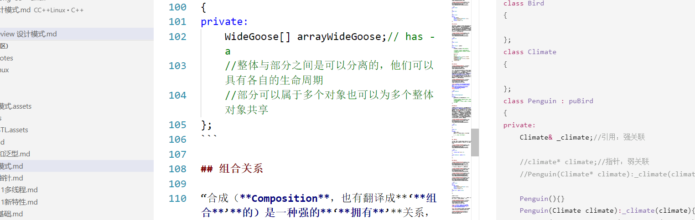

# 面向对象设计原则

单一职责原则：类的职责要单一，不能将太多的职责放在一个类中

开闭原则：软件实体对扩张开放对修改关闭，即在不需改软件实体的情况的基础上去扩展其功能

里氏代换原则：

‘依赖倒转原则：


接口隔离原则：

合成复用原则：
迪米特法则：


# UML类图示例


## 依赖关系

“动物几大特征，比如有新陈代谢，能繁殖。而动物要有生命力，需要氧气、水以及食物等。也就是说，动物依赖于氧气和水。他们之间是依赖关系（Dependency），用虚线箭头来表示。”


```c++
class Oxygen
{
    
};
class Water
{
    
};
class Animal
{
public:
    bool Alive;
	virtual Metabolism(Oxygen oxygen,Water water) = 0;
    virtual breed() = 0;
};
```

## 关联关系

“你看企鹅和气候两个类，企鹅是很特别的鸟，会游不会飞。更重要的是，它与气候有很大的关联。我们不去讨论为什么北极没有企鹅，为什么它们要每年长途跋涉。总之，企鹅需要‘知道’气候的变化，需要‘了解’气候规律。当一个类‘知道’另一个类时，可以用关联（association）。关联关系用实线箭头来表示。“


```c++
class Bird
{
    
};
class Climate
{
    
};
class Penguin : puBird
{
private:
    Climate& _climate;//引用：强关联
    
    //climate* climate;//指针：弱关联
    //Penguin(Climate* climate):_climate(climate){}
    
    Penguin(){}                                  //error
    Penguin(Climate climate):_climate(climate){} //error
    Penguin(Climate& climate):_climate(climate){}//ok
    ~Penguin(){}
};
```

## 聚合关系


“我们再来看大雁与雁群这两个类，大雁是群居动物，每只大雁都是属于一个雁群，一个雁群可以有多只大雁。所以它们之间就满足聚合（Aggregation）关系。聚合表示一种弱的**‘**拥有**’**关系，体现的是**A**对象可以包含**B**对象，但**B**对象不是**A**对象的一部分 [DPE]（DPE表示此句摘自《设计模式》（第2版），详细摘要说明见附录二）。聚合关系用空心的菱形+实线箭头来表示。”


```c++
class WideGoose
{
    
};
class WideGooseAggregate
{
private:
    WideGoose[] arrayWideGoose;// has - a
    //整体与部分之间是可以分离的，他们可以具有各自的生命周期
    //部分可以属于多个对象也可以为多个整体对象共享
};
```


## 组合关系

“合成（**Composition**，也有翻译成**‘**组合**’**的）是一种强的**‘**拥有**’**关系，体现了严格的部分和整体的关系，部分和整体的生命周期一样 [DPE]。在这里鸟和其翅膀就是合成（组合）关系，因为它们是部分和整体的关系，并且翅膀和鸟的生命周期是相同的。合成关系用实心的菱形+实线箭头来表示。另外，你会注意到合成关系的连线两端还有一个数字‘1’和数字‘2’，这被称为基数。表明这一端的类可以有几个实例，很显然，一个鸟应该有两只翅膀。如果一个类可能有无数个实例，则就用‘n’来表示。关联关系、聚合关系也可以有基数的。“


```c++
class Wing
{
    
};

class Bird
{
private:
    Wing _wing;
    public Bird(Wing wing):_wing(wing)
    {
       // _wing = new Wing();
    }  
};
```

## 实现关系

“我举的几种鸟中，大雁是最能飞的，我让它实现了飞翔接口。实现接口用空心三角形+虚线来表示。”


```c++
struct IFly
{
    virtual void Fiy() = 0;
};

class WideGoose : public IFly
{
    
};
```

## 泛化关系


“继承关系用空心三角形+实线来表示。“


```c++
class Animal
{
public:
    bool Alive;
	virtual Metabolism(Oxygen oxygen,Water water) = 0;
    virtual breed() = 0;
};
class Bird : public Animal
{
    
};
```

结构型设计模式

从依赖关系上来说：继承 == 实行 > 组合 > 聚合 > 关联 >  依赖）(组合优于继承)


