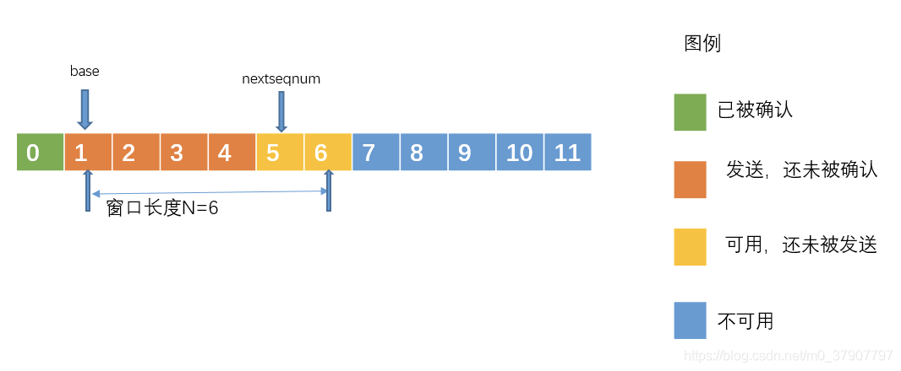
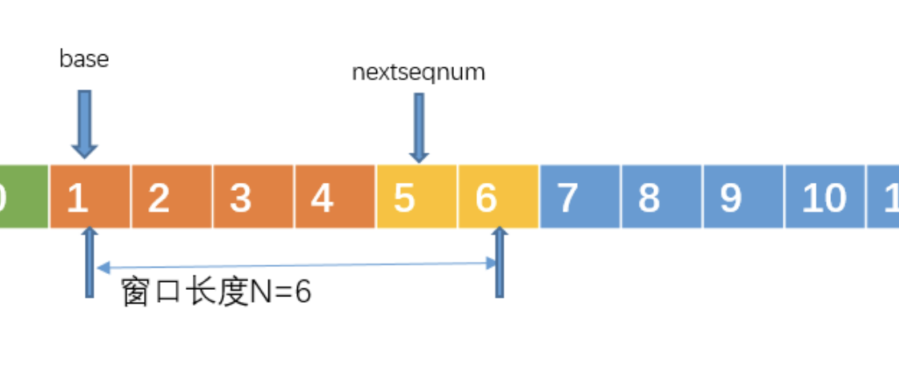
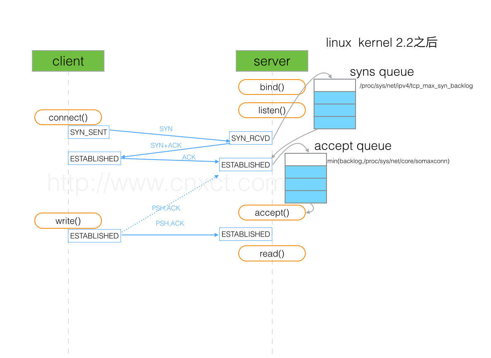

# OSI 的七层模型分别是？各自的功能是什么？ 

- 物理层（Physical Layer）：

    - 功能：负责在物理媒介上传输原始比特流，包括电压、光信号等。它定义了传输数据时的电气特性和物理连接接口标准。
- 数据链路层（Data Link Layer）：

    - 功能：提供数据包的传输和识别。它负责将原始的物理位流转换为有意义的数据帧，并处理物理层的错误。该层通常分为两个子层：逻辑链路控制（Logical Link Control，LLC）和介质访问控制（Media Access Control，MAC）。主要有（PPP协议、CSMA/CD协议）
- 网络层（Network Layer）：

    - 功能：提供数据包的路由和转发。它负责将数据从源主机传输到目标主机，通过寻址和路由选择来管理子网之间的通信。（重点IP协议）
- 传输层（Transport Layer）：

    - 功能：负责端到端的数据传输，提供可靠的数据传输服务。它通过连接控制、流量控制和差错检测来确保数据的正确传输，并解决了网络层的可靠性和顺序性问题。（TCP/UDP）
- 会话层（Session Layer）：

    - 功能：管理应用程序之间的通信会话。它负责建立、管理和终止会话连接，并处理数据交换的同步和检查点。（scoket）
- 表示层（Presentation Layer）：

    - 功能：处理数据的表示和编码，确保数据在不同系统之间的格式兼容性。它负责数据的加密、压缩、格式转换和数据结构的定义。
- 应用层（Application Layer）：

    - 功能：为用户提供网络服务和应用程序功能。它是用户与网络之间的接口，支持各种网络应用，如电子邮件、文件传输、远程登录等

**简要概括**

- 物理层：底层数据（比特流）传输。

- 数据链路层：提供介质访问、链路管理等。

- 网络层：寻址和路由选择。

- 传输层：建立主机到端的连接。

- 会话层：建立、维护和管理会话。

- 表示层：处理数据格式，数据加密。

- 应用层：提供应用程序间通信。

**说明**：

- 从物理层往上（数据的称呼）：比特流->帧->包->段。

# TCP和UDP的区别？

TCP（Transmission Control Protocol）和UDP（User Datagram Protocol）是两种常见的传输层协议，它们在网络通信中有一些重要的区别：

1. **连接性**：
    - TCP 是面向连接的协议，它在通信之前需要先建立连接，然后进行数据传输，最后释放连接。
    - UDP 是无连接的协议，通信双方之间不需要建立持久的连接，每个数据包都是独立的，相互之间没有顺序关系。
2. **可靠性**：
    - TCP 提供可靠的数据传输，它通过序列号、确认和重传机制来确保数据的可靠性，保证数据按顺序到达，并且重传丢失的数据包。
    - UDP 不提供可靠性保证，它不会跟踪数据包的传输状态或重传丢失的数据包，因此在传输过程中可能会丢失数据包，也不保证数据包的顺序。
3. **流量控制和拥塞控制**：
    - TCP 实现了流量控制和拥塞控制机制，以避免网络拥塞并确保传输效率。它使用窗口控制机制来限制发送方发送数据的速率，并根据网络状况动态调整。
    - UDP 不提供流量控制或拥塞控制功能，发送方无法控制发送速率，因此可能会导致网络拥塞。
4. **头部开销**：
    - TCP 的头部开销比 UDP 大，因为 TCP 需要维护连接状态、序列号等信息，头部长度通常较长。
    - UDP 的头部开销较小，只包含源端口、目标端口、数据长度和校验和等基本信息。
5. **应用场景**：
    - TCP 适用于要求可靠性和顺序传输的应用，如网页浏览、文件传输、电子邮件等。
    - UDP 适用于对传输延迟要求较低、实时性要求较高的应用，如音视频流媒体、在线游戏等。

总的来说，TCP 提供了可靠的、面向连接的数据传输，适用于对数据完整性和顺序性要求较高的应用；而UDP 则提供了更轻量级的、无连接的传输，适用于实时性要求较高、容忍数据丢失的应用。

# 滑动窗口和拥塞控制？


滑动窗口和拥塞控制是 TCP 协议中两个不同但密切相关的机制，它们共同确保了 TCP 的可靠性和网络的稳定性。

1. **滑动窗口和流量控制**：
    - 滑动窗口是用于流量控制的机制，它通过调整发送方和接收方之间的数据传输窗口大小来控制数据流量。滑动窗口机制允许发送方连续发送多个数据包而无需等待确认，从而提高了网络的利用率。
    - 流量控制是为了防止发送方发送过多的数据而导致接收方无法及时处理，从而引发数据丢失或缓冲区溢出。滑动窗口通过动态调整发送窗口大小，使得发送方可以根据接收方的接收能力来调整发送速率，从而避免了流量过载问题。
2. **拥塞控制**：
    - 拥塞控制是 TCP 协议中另一个重要的机制，它是为了防止网络拥塞和确保网络的稳定性。拥塞控制通过动态调整发送方的发送速率来适应网络的拥塞程度，以避免网络过载和丢包现象。
    - 拥塞控制的算法包括慢启动、拥塞避免、快速重传和快速恢复等。这些算法会根据网络的拥塞程度和丢包情况来调整发送窗口的大小和发送速率，从而避免了网络拥塞和丢包问题。
3. **关系**：
    - 滑动窗口机制可以看作是 TCP 协议中的流量控制的实现方式，而拥塞控制则是为了解决网络拥塞的问题。
    - 两者之间的关系在于，滑动窗口机制可以根据接收方的接收能力来动态调整发送窗口大小，而拥塞控制则可以根据网络的拥塞情况来动态调整发送速率。因此，它们共同确保了 TCP 的可靠性和网络的稳定性。

综上所述，滑动窗口和拥塞控制是 TCP 协议中两个不可或缺的机制，它们共同作用于 TCP 数据传输的不同层面，以确保数据传输的可靠性、高效性和网络的稳定性


# ARP 协议的作用及工作原理？为什么不直接使用MAC地址进行通信？

### **地址解析协议ARP**的作用及工作原理？

- 作用：已经知道一个机器（主机或路由器）的IP地址，需要找出其硬件地址（IP协议使用了ARP协议）

**工作原理**

- 局域网内：A要向B发送IP数据报时，首先在ARP高速缓存中查看有无主机B的IP地址，如果有查出该主机B的MAC地址并且写入到MAC帧中，然后通过局域网将MAC帧发送到主机B。如果查不到主机B的IP地址就向本地网段广播发送一个 ARP 请求，查询此目的主机对应的 MAC 地址。将进行如下步骤：

1. ARP进程在本局域网上广播发送ARP请求分组(主要内容包括：IP src 、MAC src 、IP dest)。
2. 本局域网上所有的主机上的ARP进程都会收到该请求分组，其中B的IP地址和IP dest 相同，接送这个请求分组并将A的IP地址和MAC地址写入到B的ARP高速缓存中，并以单播的形式向主机A发送响应报文（IP src 、MAK src）。
3. 主机A收到B的响应分组后，将B的IP地址、MAC地址写入到ARP。

**说明**：ARP高速缓存中都的每一个地址映射都有一个生存时间到了时间，就会从高速缓存中删除掉。

### 为什么不直接使用MAC地址进行通信？

全世界的网络非常复杂，使用不同的硬件地址。如果不使用IP地址要消除这些异构的网络之间的差异是非常复杂的。


# 通信双方如何保证数据不丢失？

由于数据在网络之间传输是以分组的形式进行，在此将问题转化为如何保证每个分组传输的正确性，在传输分组时主要存在两个问题：

- 在传输过程中由于信道干扰，导致传输的数据出现差错
- 分组为到达目的地便出现丢失的情况（丢包）

（1）分组出差错的处理（假设A给B发送消息）

A给B发送消息的时后面加一个校验码，如果没有差错的话，计算机B就给计算机A发送一个ACK分组，告诉对方，数据正确无误。如果出现差错的话，就给对方发送一个NAK分组，告诉对方，分组数据出现了差错。当计算机A收到接受方的反馈之后，如果收到的是ACK分组，那么就继续发送下一个分组数据。如果收到的是NAK分组，那么就重新传输这个分组。ACK分组传输出错(A无法识别)或收到NAK，A也重新发送这个分组，我们可以给每个分组添加一个序号啊，这样就可以知道是重传的分组还是新的分组了。如果B收到的分组没出差错，这时又收到一个序号相同的分组，这时B就知道这个分组是属于重传的分组了，这时B就把这个重传的分组丢弃。

（2）分组丢失	

- 回退N步协议(GBN)【**滑动窗口协议**】



[0, base-1]段内的序号对应已发送并且已经确认的分组序号

[base,nextseqnum]段内对应已经发送但未确认的分组序号

[nextseqnum, base+N-1]段内表示即将要被发送的分组序号

而那些大于base+N的序号目前还不能使用，直到当前流水线中未被确认的分组得到确认，窗口整体向右移动之后，才能够被使用

对于GBN协议，计算机A(发送方)需要响应以下两个事件：

1、收到一个ACK：在GBN协议中，对序号为n的分组的确认采取累计确认的方式。也就是说，当A收到序号为n的分组时，表明分组n以及n之前的分组已经被B正确接受了。

2、超时事件： 当久久没有收到ACK时，A就认为它发送的分组已经丢失了，这时A会重传所有已发送但还未被确认的分组。这个时候需要注意的是，并不是为每个分组设置一个定时器，而是在序号[base,nextseqnum-1]中，设置一个定时器，当base发送的那一刻，就开始计时，当收到一个ACK时，则刷新重新开始计时。

计算机B(接收方)则需要处理一下事件：

如果一个序号为n的分组被正确收到，并且按序(所谓按序就是指n-1的分组也已经收到了)，则B为分组n发送一个ACK，否则，丢弃该分组，并且为最近按序接收的分组重新发送ACK。

- **选择重传**

回退N步协议的缺点也是很明显的，单个分组的差错能够引起GBN重传大量的分组，而且许多分组根本就没有必要重传，不过选择重传和回退N步是很相似的，只是在选择重传中，接收方收到失序的分组时，会把它缓存起来，直到拼凑到分组按序，才把分组传输给上一层。而发送方会为每个分组设置一个定时器，这样，只需要重传那些没有被接收方正确接收的分组就可以了。




# 集线器、交换机与路由器有什么区别？

**集线器**：是微型计算机，他本身具备多个网口，专门实现多台计算机的互联作用，这个微型计算机就是**集线器**（HUB）。顾名思义，集线器起到了一个将网线集结起来的作用，实现最初级的网络互通。集线器是通过网线直接传送数据的，我们说他工作在**物理层**。

集线器有一个问题，由于和每台设备相连，他不能分辨出具体信息是发送给谁的，只能广泛的**广播**出去。

例如小A本来想问小C：你吃了吗？结果小B，小D和小E等所有连接在集线器上的用户都收到了这一信息，且由于处于同一网络，小A说话时其他人不能发言，否则信息间会产生**碰撞**，引发错误，我们叫做各设备处于同一**冲突域内**。

**交换机**：在集线器设备加入一个指令，让他可以**根据网口名称自动寻址传输数据**。交换机设备解决了冲突的问题，实现了任意两台电脑间的互联，大大地提升了网络间的传输速度，我们把它叫做**交换机**。由于交换机是根据网口地址传送信息，比网线直接传送多了一个步骤，我们也说交换机工作在**数据链路层**。

**路由器**：小伙伴们规定，不同的村子间先在各自的操作系统上加上一套相同的**协议**。不同村落通信时，信息经协议加工成统一形式，再经由一个特殊的设备传送出去。这个设备就叫做**路由器**。路由器通过IP地址寻址，我们说它工作在计算机的**网络层**。

这样，经由如此的一系列改装，小A终于带领村民们实现了整个乡镇的通信。随着越来越多的城里人也加入小A的协议，小A带领村民逐步实现了全市、全国乃至全世界的通信。这一套协议便是**TCP/IP协议簇**，互联网也便这样形成了。	

总结：交换机适合局域网内互联，路由器实现全网段互联。

# Web网站安全

## 什么是URL操作攻击？

- URL操作攻击的**原理**一般是：通过URL来猜测某些资源的存放地址，从而非法的访问受保护的资源。

解决方法：

- 为了避免非登录用户的访问，对于每个只用登录成功的页面而言，应该进行seession检查。

- 为限制用户访问未授权的资源，可在查询是将用户的用户名也考虑进去。

## 什么是Web跨站脚本攻击（XSS）？

**跨站脚本**：恶意攻击者利用网站没有对用户提交数据进行转义处理或者过滤不足的缺点，进而添加一些脚本代码嵌入到web页面中去，使别的用户访问都会执行相应的嵌入代码，从而盗取用户资料、利用用户身份进行某种动作或者对访问者进行病毒侵害的一种攻击方式。

**XSS攻击的危害**：

盗取各类用户帐号，如机器登录帐号、用户网银帐号、各类管理员帐号

控制企业数据，包括读取、篡改、添加、删除企业敏感数据的能力

盗窃企业重要的具有商业价值的资料

非法转账

强制发送电子邮件

网站挂马

控制受害者机器向其它网站发起攻击

**主要原因**：过于信任客户端提交的数据！

解决办法：不信任任何客户端提交的数据，只要是客户端提交的数据就应该先进行相应的过滤处理然后方可进行下一步的操作。进一步分析细节：客户端提交的数据本来就是应用所需要的，但是恶意攻击者利用网站对客户端提交数据的信任，在数据中插入一些符号以及JavaScript代码，那么这些数据将会成为应用代码中的一部分了，那么攻击者就可以肆无忌惮地展开攻击啦，因此我们绝不可以信任任何客户端提交的数据！！！

将重要的cookie标记为http only, 这样的话JavaScript 中的document. Cookie语句就不能获取到cookie了（如果在cookie中设置了HTTP Only属性，那么通过js脚本将无法读取到cookie信息，这样能有效的防止XSS攻击）

表单数据规定值的类型，

过滤JavaScript 事件的标签，

过滤或移除特殊的Html标签，

对数据进行Html Encode 处理

## 什么是SQL 注入？举个例子？

**SQL注入**：就是通过把SQL命令插入到Web表单提交或输入域名或页面请求的查询字符串，最终达到欺骗服务器执行恶意的SQL命令。

1). SQL注入攻击的总体思路

　　(1). 寻找到SQL注入的位置
　　(2). 判断服务器类型和后台数据库类型
　　(3). 针对不同的服务器和数据库特点进行SQL注入攻击

2). SQL注入攻击实例

比如，在一个登录界面，要求输入用户名和密码，可以这样输入实现免帐号登录：

```sql
用户名： ‘or 1 = 1 --
密 码：
```

3). 应对方法

(1). 参数绑定

使用预编译手段，绑定参数是最好的防SQL注入的方法。目前许多的ORM框架及JDBC等都实现了SQL预编译和参数绑定功能，攻击者的恶意SQL会被当做SQL的参数而不是SQL命令被执行。在mybatis的mapper文件中，对于传递的参数我们一般是使用 # 和`$`来获取参数值。当使用#时，变量是占位符，就是一般我们使用javajdbc的Prepare Statement时的占位符，所有可以防止sql注入；当使用`$`时，变量就是直接追加在sql中，一般会有sql注入问题。

(2). 使用正则表达式过滤传入的参数


# TIME_WAIT状态的产生原因与避免？

## TIME_WAIT的如何产生？

首先调用close()发起主动关闭的一方，在发送最后一个ACK之后会进入time_wait的状态，也就说该发送方会保持2MSL时间之后才会回到初始状态。MSL值得是数据包在网络中的最大生存时间。产生这种结果使得这个TCP连接在2MSL连接等待期间，定义这个连接的四元组（客户端IP地址和端口，服务端IP地址和端口号）不能被使用。

## TIME_WAIT状态产生的原因？

- **为实现TCP全双工连接的可靠释放**

	由TCP状态变迁图可知，假设发起主动关闭的一方（client）最后发送的ACK在网络中丢失，由于TCP协议的重传机制，执行被动关闭的一方（server）将会重发其FIN，在该FIN到达client之前，client必须维护这条连接状态，也就说这条TCP连接所对应的资源（client方的local_ip,local_port）不能被立即释放或重新分配，直到另一方重发的FIN达到之后，client重发ACK后，经过2MSL时间周期没有再收到另一方的FIN之后，该TCP连接才能恢复初始的CLOSED状态。如果主动关闭一方不维护这样一个TIME_WAIT状态，那么当被动关闭一方重发的FIN到达时，主动关闭一方的TCP传输层会用RST包响应对方，这会被对方认为是有错误发生，然而这事实上只是正常的关闭连接过程，并非异常。

- **为使旧的数据包在网络因过期而消失**

	为说明这个问题，我们先假设TCP协议中不存在TIME_WAIT状态的限制，再假设当前有一条TCP连接：(local_ip, local_port, remote_ip,remote_port)，因某些原因，我们先关闭，接着很快以相同的四元组建立一条新连接。本文前面介绍过，TCP连接由四元组唯一标识，因此，在我们假设的情况中，TCP协议栈是无法区分前后两条TCP连接的不同的，在它看来，这根本就是同一条连接，中间先释放再建立的过程对其来说是“感知”不到的。这样就可能发生这样的情况：前一条TCP连接由local peer发送的数据到达remote peer后，会被该remot peer的TCP传输层当做当前TCP连接的正常数据接收并向上传递至应用层（而事实上，在我们假设的场景下，这些旧数据到达remote peer前，旧连接已断开且一条由相同四元组构成的新TCP连接已建立，因此，这些旧数据是不应该被向上传递至应用层的），从而引起数据错乱进而导致各种无法预知的诡异现象。作为一种可靠的传输协议，TCP必须在协议层面考虑并避免这种情况的发生，这正是TIME_WAIT状态存在的第2个原因。

- **总结**

	具体而言，local peer主动调用close后，此时的TCP连接进入TIME_WAIT状态，处于该状态下的TCP连接不能立即以同样的四元组建立新连接，即发起active close的那方占用的local port在TIME_WAIT期间不能再被重新分配。由于TIME_WAIT状态持续时间为2MSL，这样保证了旧TCP连接双工链路中的旧数据包均因过期（超过MSL）而消失，此后，就可以用相同的四元组建立一条新连接而不会发生前后两次连接数据错乱的情况

#  3次握手，2个队列



 

在三次握手协议中，服务器维护一个半连接队列，该队列为每个客户端的SYN包开设一个条目(服务端在接收到SYN包的时候，就已经创建了request_sock结构，存储在半连接队列中)，该条目表明服务器已收到SYN包，并向客户发出确认，正在等待客户的确认包（会进行第二次握手发送SYN＋ACK 的包加以确认）。这些条目所标识的连接在服务器处于Syn_RECV状态，当服务器收到客户的确认包时，删除该条目，服务器进入ESTABLISHED状态。
该队列为SYN 队列，长度为 max(64, /proc/sys/net/ipv4/tcp_max_syn_backlog) ，在机器的tcp_max_syn_backlog值在/proc/sys/net/ipv4/tcp_max_syn_backlog下配置。

# syn flood

Client发送SYN包给Server后挂了，

Linux下默认会进行**5次重发SYN-ACK包**，重试的间隔时间从1s开始，下次的重试间隔时间是前一次的双倍，5次的重试时间间隔为1s, 2s, 4s, 8s, 16s，**总共31s**，**第5次发出后还要等32s都知道第5次也超时了，所以，总共需要 1s + 2s + 4s+ 8s+ 16s + 32s = 63s，**TCP才会把断开这个连接。由于，SYN超时需要63秒，那么就给攻击者一个攻击服务器的机会，攻击者在短时间内发送大量的SYN包给Server(俗称 SYN flood 攻击)，用于耗尽Server的SYN队列。**对于应对SYN 过多的问题**，linux提供了几个TCP参数：tcp_syncookies、tcp_synack_retries、tcp_max_syn_backlog、tcp_abort_on_overflow 来调整应对。

# syncookie

Linux实现了一种称为SYNcookie的机制，通过net.ipv4.tcp_syncookies控制，设置为1表示开启。**简单说SYNcookie就是将连接信息编码在ISN(initialsequencenumber)中返回给客户端，这时server不需要将半连接保存在队列中，而是利用客户端随后发来的ACK带回的ISN还原连接信息，以完成连接的建立，避免了半连接队列被攻击SYN包填满**。


对于SYN半连接队列的大小是由（/proc/sys/net/ipv4/tcp_max_syn_backlog）这个内核参数控制的，有些内核似乎也受listen的backlog参数影响，取得是两个值的最小值。**当这个队列满了，不开启syncookies的时候，Server会丢弃新来的SYN包，而Client端在多次重发SYN包得不到响应而返回（`connection time out`）错误。但是，当Server端开启了syncookies=1，那么SYN半连接队列就没有逻辑上的最大值了，并且/proc/sys/net/ipv4/tcp_max_syn_backlog设置的值也会被忽略。**
