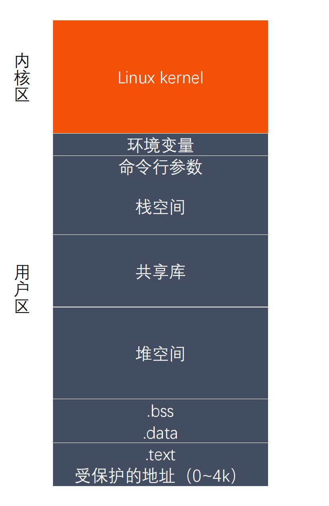
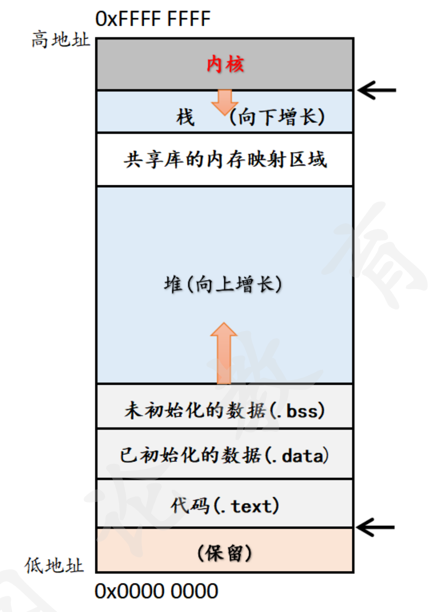

# **程序编译链接的具体过程**？

## **预编译**：

- 主要处理源代码文件中以“#”开头的预编译指令。

  1. 删除所有的#define，展开所有的宏定义。

  2. 处理所有的条件预编译指令，像：#if 、#endif、#ifdef ”#elif“和#else。

  3. 处理#include预编译指令，将文件的内容拷贝到它的位置，这个过程是递归进行的，文件中包含其他文件。

  4. 删除所有的注释，“//",和” /* */"。

  5. 保留所有的#pragma,编译器需要用到它，如：#pragma once是防止头文件被重复引入。

## **编译** ：

- 把预编译之后生成的xxx.i或xxx.ii文件，进行一系列的语法分析、词法分析、语义分析和优化后生成相应的汇编代码文件。

  1. 词法分析：利用类似于”有限状态机“的算法，将源代码程序输入到扫描机中，将其中的字符序列分割成一系列记号。
  2. 语法分析：语法分析器对由扫描器产生的记号，进行语法分析，产生语法树。由语法分析器输出的语法树是一种以表达式为节点的树。
  3. 语义分析：语法分析器只是完成了对表达式语法层面的分析，语义分析器则对表达式是否有意义进行判断，其分析的语义是静态语义——在编译期能分期的语义，相对应的动态语义是在运行期才能确定的语义。
  4. 优化：源代码级别的一个优化过程。
  5. 目标代码生成：由代码生成器将中间代码转换成目标机器代码，生成一系列的代码序列——汇编语言表示。
  6. 目标代码优化：目标代码优化器对上述的目标机器代码进行优化：寻找合适的寻址方式、使用位移来替代乘法运算、删除多余的指令等。

## **汇编**：

- 将汇编代码转化成机器可以执行的指令（机器码文件）。汇编器的汇编过程相对于编译器来说更简单，没有复杂的语法，也没有语义，更不需要做指令优化，只是根据汇编指令和机器指令的对照表一一翻译过来，汇编过程有汇编器as完成。

  经汇编之后，产生目标文件(与可执行文件格式几乎一样)xxx.o(Linux下)、xxx.obj(Windows下)。

## **链接**：

- 将不同的源文件产生的目标文件进行链接,从而形成一个可以执行的程序。链接分为动态链接和静态链接：

  1. **静态链接：** 函数和数据被编译进一个二进制文件。在使用静态库的情况下，在编译链接可执行文件时，链接器从库中复制这些函数和数据并把它们和应用程序的其它模块组合起来创建最终的可执行文件。

     缺点：空间浪费，因为每个可执行程序中对所有需要的目标文件都要有一份副本，所以如果多个程序对同一个目标文件都有依赖，会出现同一个目标文件都在内存存在多个副本；更新困难：每当库函数的代码修改了，这个时候就需要重新进行编译链接形成可执行程序。

     优点：在可执行程序中已经具备了所有执行程序所需要的任何东西，在执行的时候运行速度快。

  2. **动态链接：** 动态链接的基本思想是把程序按照模块拆分成各个相对独立部分，在程序运行时才将它们链接在一起形成一个完整的程序，而不是像静态链接一样把所有程序模块都链接成一个单独的可执行文件。

     共享库：就是即使需要每个程序都依赖同一个库，但是该库不会像静态链接那样在内存中存在多份副本，而是这多个程序在执行时共享同一份副本；

     更新方便：更新时只需要替换原来的目标文件，而无需将所有的程序再重新链接一遍。当程序下一次运行时，新版本的目标文件会被自动加载到内存并且链接起来，程序就完成了升级的目标。

     性能损耗：因为把链接推迟到了程序运行时，所以每次执行程序都需要进行链接，所以性能会有一定损失

     ---

1. 预编译：这个过程主要的处理操作如下：

    （1） 将所有的#define删除，并且展开所有的宏定义

    （2） 处理所有的条件预编译指令，如#if、#ifdef

    （3） 处理#include预编译指令，将被包含的文件插入到该预编译指令的位置。

    （4） 过滤所有的注释

    （5） 添加行号和文件名标识。

2. 编译：这个过程主要的处理操作如下：

    （1） 词法分析：将源代码的字符序列分割成一系列的记号。

    （2） 语法分析：对记号进行语法分析，产生语法树。

    （3） 语义分析：判断表达式是否有意义。

    （4） 代码优化：

    （5） 目标代码生成：生成汇编代码。

    （6） 目标代码优化：

3. 汇编：这个过程主要是将汇编代码转变成机器可以执行的指令。

4. 链接：将不同的源文件产生的目标文件进行链接，从而形成一个可以执行的程序。

    链接分为静态链接和动态链接。

    静态链接，是在链接的时候就已经把要调用的函数或者过程链接到了生成的可执行文件中，就算你在去把静态库删除也不会影响可执行程序的执行；生成的静态链接库，Windows下以.lib为后缀，Linux下以.a为后缀。

    而动态链接，是在链接的时候没有把调用的函数代码链接进去，而是在执行的过程中，再去找要链接的函数，生成的可执行文件中没有函数代码，只包含函数的重定位信息，所以当你删除动态库时，可执行程序就不能运行。生成的动态链接库，Windows下以.dll为后缀，Linux下以.so为后缀。

# 静态库的制作&动态库的制作

##  静态库命名规则：

Linux : **libxxx.a**

​	lib : 前缀（固定）

​	xxx : 库的名字，自己起

​	.a : 后缀（固定）

Windows : **libxxx.lib**

# 静态库的制作：

gcc 获得（-c） .o 文件 将 .o 文件打包，使用 ar 工具（archive）

**ar rcs libxxx.a xxx.o xxx.o**

​	r – 将文件插入备存文件中

​	c – 建立备存文件

​	s – 索引

gcc -c  *.c -I ../include/

ar rcs libcalc.a  *.o

gcc main.c -o main -I ./include -lcalc -L ./lib

## 进程和线程的基本概念?

**进程**：进程是系统进行资源分配和调度的一个独立单位，是系统中的并发执行的单位。

**线程**：线程是进程的一个实体，也是 CPU 调度和分派的基本单位，它是比进程更小的能独立运行的基本单位，有时又被称为轻权进程或轻量级进程。

## 进程与线程的区别？

进程是具有一定独立功能的程序关于某个数据集合上的一次运行活动,进程是系统进行资源分配和调度的一个独立单位。

线程是进程的一个实体, 是CPU调度和分派的基本单位,它是比进程更小的能独立运行的基本单位.线程自己基本上不拥有系统资源,只拥有一点在运行中必不可少的资源(如程序计数器,一组寄存器和栈),但是它可与同属一个进程的其他的线程共享进程所拥有的全部资源。

一个线程可以创建和撤销另一个线程，同一个进程中的多个线程之间可以并发执行。

## 为什么有了进程还要有线程？

- **进程的提出**

	进程这个概念是在**多道程序设计**中引入的，在此之前的是**批处理程序**，所以进程主要是用来解决**程序不能并发执行从而导致 CPU 利用率低下**这个问题的。也就是问题中提到的**为了程序的并发执行**。多个进程并发执行就需要进程管理，**进程管理**，就是在程序之上**抽象**出了进程的概念，然后通过进程状态、上下文切换、中断、调度等等手段，最终实现**使程序在多道程序环境下能并发执行，并能对并发执行的程序加以控制和描述**。

- **进程的缺点**

1. 进程只能在一个时间干一件事，如果想同时干两件事或多件事，进程就无能为力了。
2. 进程在执行的过程中如果阻塞，例如等待输入，整个进程就会挂起，即使进程中有些工作不依赖于输入的数据，也将无法执行。

- **线程的引入**

	有与进程同一时间只可以处理一件事，如果阻塞便无法执行了，为了进一步提高提高进程的并发度与CPU的利用率（有效地利用多处理器和多核计算机）于是提出了线程

## 进程间的通信方式有哪些？

### 管道

### 共享内存

### 消息队列

### 信号量

## 进程的调度算法有哪些？

先来先服务调度算法：

时间片轮转调度算法：

短作业优先调度算法：

最短剩余时间优先调度算法：

高响应比优先调度算法：

优先级调度算法：

多级反馈队列调度算法：

