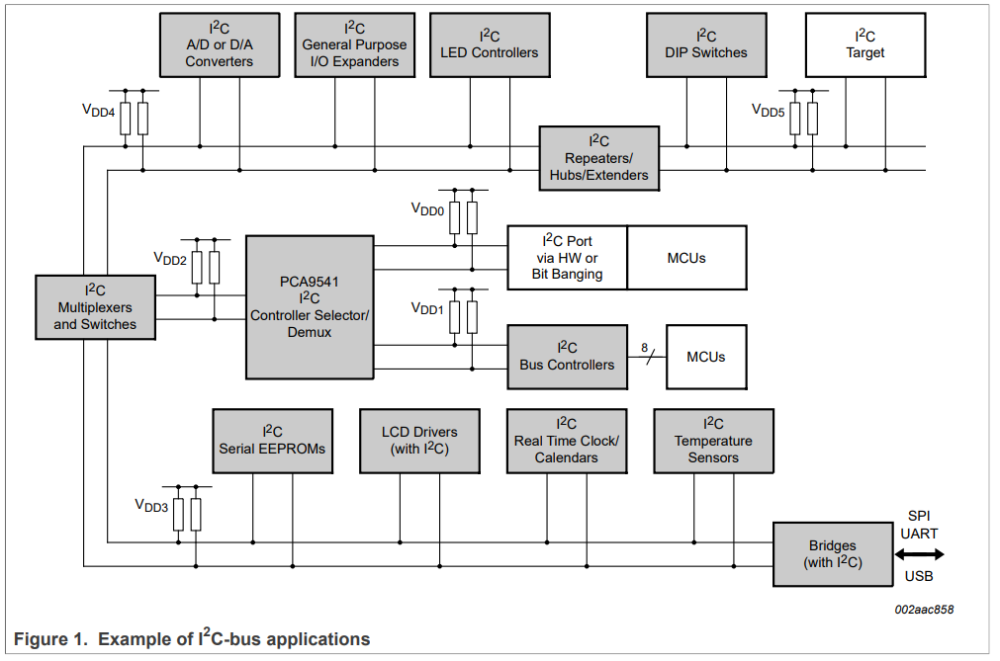
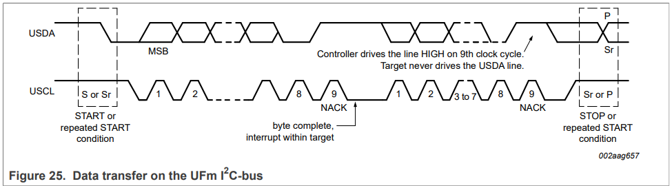
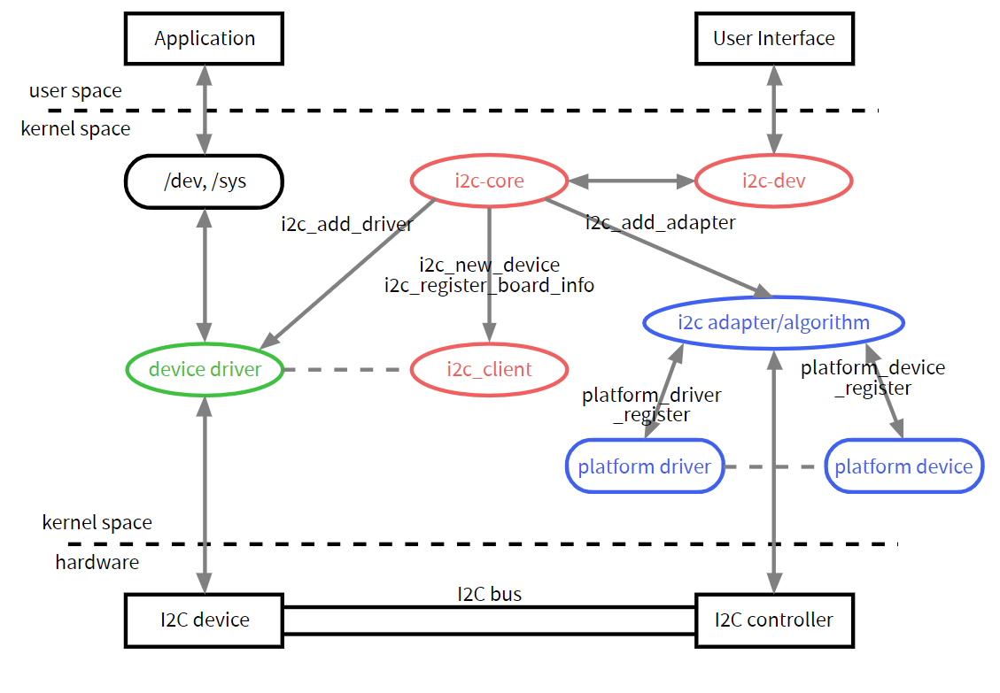

<!--slide-->
Introduction to IIC Protocol
<!-- slide -->
Outline
___
- I2C Introduction
- I2C Physical layer
- I2C Protocol layer
- I2C application layer
- References
<!-- slide -->
I2C（Inter-Integrated Circuit）
---
- 一种非常常用的低速 （100 ~ 400 kHz） 总线，用于将板载和外部设备连接到处理器。
- 仅使用两条线： SDA 用于数据， SCL 用于 clock。
- 不可即插即用。
- 它是一个主/从总线：只有 master 可以发起通信，而 slave 只能回复 master 发起的通信。
- 每个从设备都由一个 I2C 地址标识（您不能在同一总线上有 2 个具有相同地址的设备）。主服务器发起的每笔通信都包含此地址，它允许相关的从服务器识别它应该回复此特定通信。
<!-- slide -->
Example of IIC-bus application
---

- 总线通过上拉电阻接到电源。当I2C设备空闲时，会输出高阻态，而当所有设备都空闲， 都输出高阻态时，由上拉电阻把总线拉成高电平。

- 多个主机同时使用总线时，为了防止数据冲突，会利用仲裁方式决定由哪个设备占用总线
  <!-- slide -->

- start: DAT falling while CLK is high

- I2C Address is 7 bits

- Write: 0; read: 1

- ACK: 0; NACK: 1

- stop: DAT rising while CLK is high
  
  <!-- slide -->
  
  <!-- slide -->

  ````c
  struct i2c_driver {
  	unsigned int class;
   
  	/* Notifies the driver that a new bus has appeared. You should avoid
  	 * using this, it will be removed in a near future.
  	 */
  	int (*attach_adapter)(struct i2c_adapter *) __deprecated;//依附i2c_adapter函数指针
   
  	/* Standard driver model interfaces */
  	int (*probe)(struct i2c_client *, const struct i2c_device_id *);
  	int (*remove)(struct i2c_client *);
   
  	/* driver model interfaces that don't relate to enumeration  */
  	void (*shutdown)(struct i2c_client *);
  	int (*suspend)(struct i2c_client *, pm_message_t mesg);
  	int (*resume)(struct i2c_client *);
   
  	/* Alert callback, for example for the SMBus alert protocol.
  	 * The format and meaning of the data value depends on the protocol.
  	 * For the SMBus alert protocol, there is a single bit of data passed
  	 * as the alert response's low bit ("event flag").
  	 */
  	void (*alert)(struct i2c_client *, unsigned int data);
   
  	/* a ioctl like command that can be used to perform specific functions
  	 * with the device.
  	 */
  	int (*command)(struct i2c_client *client, unsigned int cmd, void *arg);//命令列表
   
  	struct device_driver driver;
  	const struct i2c_device_id *id_table;//该驱动所支持的设备ID表
   
  	/* Device detection callback for automatic device creation */
  	int (*detect)(struct i2c_client *, struct i2c_board_info *);
  	const unsigned short *address_list;
  	struct list_head clients;
  };
  ````

  ```c
  struct i2c_client {
  	unsigned short flags;		/* div., see below		*///标志
  	unsigned short addr;		/* chip address - NOTE: 7bit	*///低7位为芯片地址
  					/* addresses are stored in the	*/
  					/* _LOWER_ 7 bits		*/
  	char name[I2C_NAME_SIZE];                                         //设备名称
  	struct i2c_adapter *adapter;	/* the adapter we sit on	*///依附的i2c_adapter
  	struct i2c_driver *driver;	/* and our access routines	*///依附的i2c_driver
  	struct device dev;		/* the device structure		*///设备结构体
  	int irq;			/* irq issued by device		*///链表头
  	struct list_head detected;
  };
  
  struct i2c_adapter {
  	struct module *owner;  //所属模块
  	unsigned int class;		  /* classes to allow probing for */
  	const struct i2c_algorithm *algo; /* the algorithm to access the bus *///总线通信方法指针
  	void *algo_data;                                                       //algorithm数据
   
  	/* data fields that are valid for all devices	*/
  	struct rt_mutex bus_lock;                                              //控制并发访问的自旋锁
   
  	int timeout;			/* in jiffies */
  	int retries;                                                            //重试次数
  	struct device dev;		/* the adapter device */                //适配器设备
   
  	int nr;
  	char name[48];                                                          //适配器名称
  	struct completion dev_released;                                                   
   
  	struct mutex userspace_clients_lock;
  	struct list_head userspace_clients;                                      //链表头
   
  	struct i2c_bus_recovery_info *bus_recovery_info;
  };
  ```

  

  ```c
  struct i2c_algorithm {
  	/* If an adapter algorithm can't do I2C-level access, set master_xfer
  	   to NULL. If an adapter algorithm can do SMBus access, set
  	   smbus_xfer. If set to NULL, the SMBus protocol is simulated
  	   using common I2C messages */
  	/* master_xfer should return the number of messages successfully
  	   processed, or a negative value on error */
  	int (*master_xfer)(struct i2c_adapter *adap, struct i2c_msg *msgs,//i2c传输函数指针
  			   int num);
  	int (*smbus_xfer) (struct i2c_adapter *adap, u16 addr,//smbus传输函数指针
  			   unsigned short flags, char read_write,
  			   u8 command, int size, union i2c_smbus_data *data);
   
  	/* To determine what the adapter supports */
  	u32 (*functionality) (struct i2c_adapter *);//返回适配器支持的功能
  };
  
  struct i2c_msg {
  	__u16 addr;	/* slave address			*/
  	__u16 flags;
  	__u16 len;		/* msg length				*/
  	__u8 *buf;		/* pointer to msg data			*/
  };
  ```

  

  <!-- slide -->
  这段代码是Linux内核中用于操作DS1672实时时钟（RTC)设备的驱动程序的一部分。DS1672是一个具有温度传感器功能的RTC芯片。代码中包含了两个函数，一个用于读取当前时间，另一个用于设置时间。

### 函数 `ds1672_read_time`
这个函数用于从DS1672设备读取当前时间，并将其转换为内核的`rtc_time`结构体格式。

```c
static int ds1672_read_time(struct device *dev, struct rtc_time *tm)
{
    struct i2c_client *client = to_i2c_client(dev);
    unsigned long time;
    unsigned char addr = DS1672_REG_CONTROL;
    unsigned char buf[4];

    struct i2c_msg msgs[] = {
        {/* setup read ptr */
            .addr = client->addr,
            .len = 1,
            .buf = &addr
        },
        {/* read date */
            .addr = client->addr,
            .flags = I2C_M_RD,
            .len = 1,
            .buf = buf
        },
    };

    /* read control register */
    if ((i2c_transfer(client->adapter, &msgs[0], 2)) != 2) {
        dev_warn(&client->dev, "Unable to read the control register\n");
        return -EIO;
    }

    addr = DS1672_REG_CNT_BASE;
    msgs[1].len = 4;

    /* read date registers */
    if ((i2c_transfer(client->adapter, &msgs[0], 2)) != 2) {
        dev_err(&client->dev, "%s: read error\n", __func__);
        return -EIO;
    }

    time = ((unsigned long)buf[3] << 24) | (buf[2] << 16) |
           (buf[1] << 8) | buf[0];

    rtc_time64_to_tm(time, tm);

    return 0;
}
```

1. **设置I2C消息**：定义了一个`i2c_msg`数组，用于设置读取操作的指针和读取数据。
2. **读取控制寄存器**：首先读取控制寄存器，检查操作是否成功。
3. **读取时间**：修改地址为时间计数器基地址，然后读取4个字节的时间数据。
4. **组合时间数据**：将读取的时间数据组合成一个`unsigned long`类型的值。
5. **转换时间格式**：使用`rtc_time64_to_tm`函数将时间值转换为`rtc_time`结构体。

### 函数 `ds1672_set_time`
这个函数用于将`rtc_time`结构体格式的时间设置到DS1672设备。

```c
static int ds1672_set_time(struct device *dev, struct rtc_time *tm)
{
    struct i2c_client *client = to_i2c_client(dev);
    int xfer;
    unsigned char buf[6];
    unsigned long secs = rtc_tm_to_time64(tm);

    buf[0] = DS1672_REG_CNT_BASE;
    buf[1] = secs & 0x000000FF;
    buf[2] = (secs & 0x0000FF00) >> 8;
    buf[3] = (secs & 0x00FF0000) >> 16;
    buf[4] = (secs & 0xFF000000) >> 24;
    buf[5] = 0;       /* set control reg to enable counting */

    xfer = i2c_master_send(client, buf, 6);
    if (xfer != 6) {
        dev_err(&client->dev, "%s: send: %d\n", __func__, xfer);
        return -EIO;
    }

    return 0;
}
```

1. **构建时间数据包**：将`rtc_time`结构体转换为时间值，并将其分解为字节存储在缓冲区`buf`中。
2. **发送时间数据**：使用`i2c_master_send`函数将时间数据发送到DS1672设备。
3. **错误检查**：检查发送的字节数是否正确，如果有错误，记录错误并返回。

这两个函数是Linux内核中I2C设备驱动程序的标准操作，用于处理RTC设备的时间读取和设置。


这段代码是Linux内核中用于驱动DS1672实时时钟（RTC）设备的驱动程序的一部分。它定义了如何与设备进行交互，包括初始化、读取时间、设置时间等操作。以下是代码的详细解析：

### RTC类操作结构体

```c
static const struct rtc_class_ops ds1672_rtc_ops = {
	.read_time = ds1672_read_time,
	.set_time = ds1672_set_time,
};
```

- 这段代码定义了一个结构体，包含了读取和设置时间的函数指针，这些函数将被RTC类使用。

### 探测函数（Probe Function）

```c
static int ds1672_probe(struct i2c_client *client,
			const struct i2c_device_id *id)
{
	int err = 0;
	struct rtc_device *rtc;

	if (!i2c_check_functionality(client->adapter, I2C_FUNC_I2C))
		return -ENODEV;

	rtc = devm_rtc_allocate_device(&client->dev);
	if (IS_ERR(rtc))
		return PTR_ERR(rtc);

	rtc->ops = &ds1672_rtc_ops;
	rtc->range_max = U32_MAX;

	err = rtc_register_device(rtc);

	i2c_set_clientdata(client, rtc);

	return 0;
}
```

- `ds1672_probe` 函数是驱动程序的入口点，当内核检测到一个新的I2C设备时，会调用这个函数。
- `i2c_check_functionality` 检查I2C适配器是否支持所需的功能。
- `devm_rtc_allocate_device` 分配一个RTC设备。
- `rtc->ops` 设置RTC设备的操作函数。
- `rtc_register_device` 注册RTC设备，使其可以被用户空间访问。
- `i2c_set_clientdata` 将RTC设备存储为I2C客户端的数据，以便其他地方的驱动程序代码可以使用。

### I2C设备ID

```c
static const struct i2c_device_id ds1672_id[] = {
	{ "ds1672", 0 },
	{ }
};
MODULE_DEVICE_TABLE(i2c, ds1672_id);
```

- 这段代码定义了一个I2C设备ID数组，用于匹配特定的设备。

### 设备树匹配表

```c
static const struct of_device_id ds1672_of_match[] = {
	{ .compatible = "dallas,ds1672" },
	{ }
};
MODULE_DEVICE_TABLE(of, ds1672_of_match);
```

- 这段代码定义了一个设备树兼容字符串数组，用于匹配设备树中的条目。

### I2C驱动程序结构体

```c
static struct i2c_driver ds1672_driver = {
	.driver = {
		   .name = "rtc-ds1672",
		   .of_match_table = of_match_ptr(ds1672_of_match),
	},
	.probe = &ds1672_probe,
	.id_table = ds1672_id,
};
```

- 这段代码定义了I2C驱动程序的结构体，包括驱动程序的名称、设备树匹配表、探测函数和I2C设备ID表。

### 模块加载

```c
module_i2c_driver(ds1672_driver);
```

- 这行代码告诉内核这是一个I2C驱动模块，当模块被加载时，内核会调用`ds1672_driver`的`probe`函数。

### 模块信息

```c
MODULE_AUTHOR("Alessandro Zummo <a.zummo@towertech.it>");
MODULE_DESCRIPTION("Dallas/Maxim DS1672 timekeeper driver");
MODULE_LICENSE("GPL");
```

- 这些宏定义了模块的元数据，包括作者、描述和许可证。

总的来说，这段代码是一个I2C RTC驱动程序的核心部分，它定义了如何与DS1672设备进行通信，以及如何在Linux内核中注册和使用这个设备。

<!-- slide -->

Thank you!

<!-- slide -->

