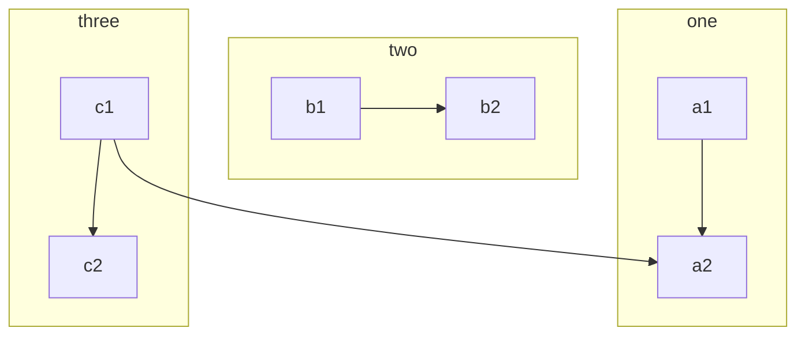
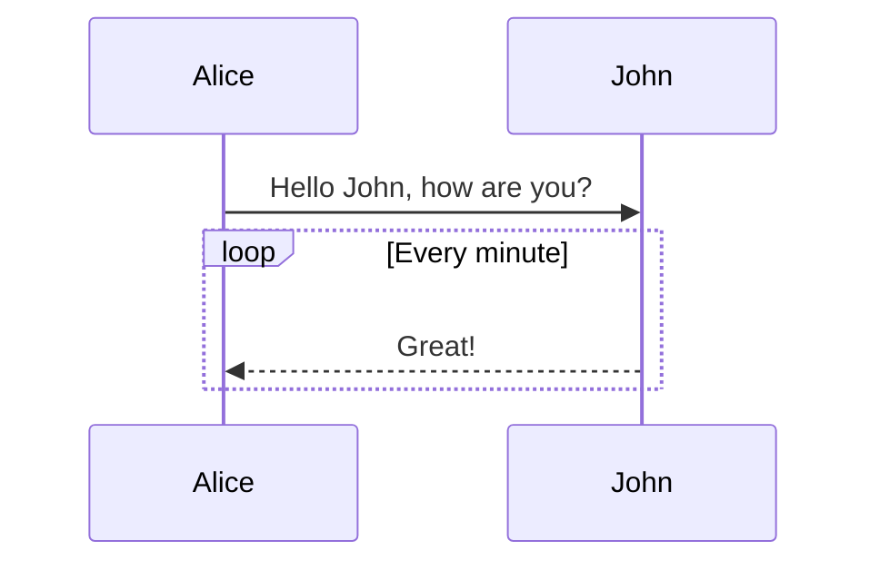
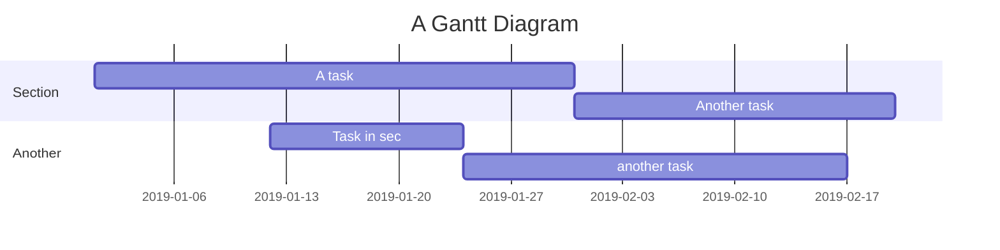
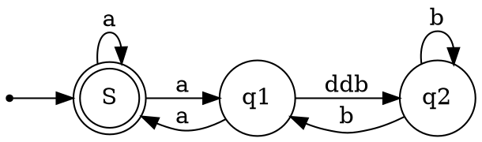

## 学习笔记

## 技术笔记


- [How_is_the_network_connected](Technical_Books/How_is_the_network_connected/1.Browser_generates_messages.md)

## 工作笔记


### 数学公式

多行公式块：

$$
\frac{1}{
  \Bigl(\sqrt{\phi \sqrt{5}}-\phi\Bigr) e^{
  \frac25 \pi}} = 1+\frac{e^{-2\pi}} {1+\frac{e^{-4\pi}} {
    1+\frac{e^{-6\pi}}
    {1+\frac{e^{-8\pi}}{1+\cdots}}
  }
}
$$

行内公式：

公式 $a^2 + b^2 = \color{red}c^2$ 是行内。


### 流程图



### 时序图



### 甘特图




### Graphviz




### 脚注

这里是一个脚注引用 [^1]，这里是另一个脚注引用 [^bignote]。
这里是一个脚注引用 [^1]，这里是另一个脚注引用 [^bignote]。

[^1]: 第一个脚注定义。
[^bignote]: 脚注定义可使用多段内容。

    缩进对齐的段落包含在这个脚注定义内。

    ```
    可以使用代码块。
    ```

<div style="color:black; background-color: blue; ">
这是带有红色字体和黄色背景色的段落。
</div>

<font color="red">这是红色的文字（使用十六进制颜色值）</font>
