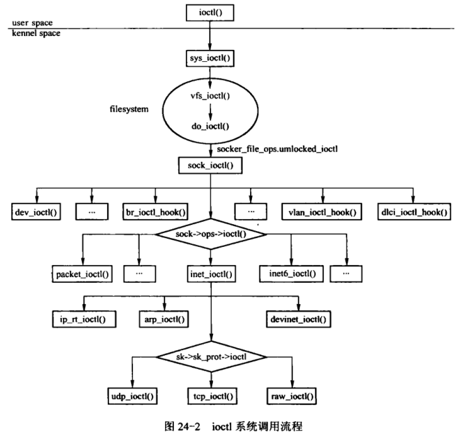

----
    theme: white.css
    width: 960
    height: 800
    minScale: 0.2
    maxScale: 1.5
    slideNumber: true
    controls: true
    transition: 'slide'
    mouseWhee: 'true'
----

<!-- slide -->
##### Universal Asynchronous Receiver/Transmitter

<!-- slide -->

<font size="5">

### what is UART 
--------
-  UART is a piece of hardware
-  Interrupt control
-  Any USART two-way communication requires at least two pins: the receiving data pin (RX) and the sending data pin output (TX)
-  Serial port level standard: TTL(3.3V) RS232(+5V ~ +12V low level, -5V ~ -12V high level)
-  Baud rate:represents the number of symbols transmitted per second, which is an index to measure the data transmission rate
-  Loop operation:UART can enter an internal loop mode for diagnosis or debugging
-  Extensive pin multiplexing is used to accommodate the largest number of peripheral 
functions in the smallest possible package

<!-- slide -->

### How UART work
----


<!-- slide -->

### Single Descriptions
-------
- UARTs使用最少的信號與外部設備進行連接。

信號名稱|信號類型|功能
:------|:-----:|:-----
UARTn_TXD|輸出|串行數據傳輸
UARTn_RXD|輸入|串行數據接收
UARTn_CTS|輸入|允許發送握手信號
UARTn_RTS|輸出|請求發送握手信號

<!-- slide -->

### Clock Generation and Control
----
](https://img.picui.cn/free/2024/09/24/66f25a41b2764.png)
- The UART bit clock is derived from an input clock to the UART.
- The processor clock generator receives a signal from an external clock source and produces a UART input clock with a programmed frequency
- The UART contains a programmable baud generator that takes an input clock and divides it by a divisor in the range between 1 and (216 - 1) to produce a baud clock (BCLK).

<!-- slide -->

### BCLK
----
- BCLK是指為了傳輸一個比特的數據而需要的時鐘週期數，用於同步數據的發送和接收
- BCLK頻率是波特率的16倍(16x)或波特率的13倍(13x)
- 當UART接收時，對於16x的採樣模式，在第8個BLCK週期進行採樣，對於13x的採樣模式，在第6個BLCK週期進行採樣。
- 16× 或 13× 参考时钟通过配置模式定义寄存器 (MDR) 中的 OSM_SEL 位来选择
   - [MDR.OSM_SEL = 0]
$$
Divisor =  \frac{UART Input Clock Frequency}{Desired Baud Rate * 16}  
$$
    - [MDR.OSM_SEL = 1] 
$$
Divisor =  \frac{UART Input Clock Frequency}{Desired Baud Rate * 13}  
$$
- 兩個8bit的寄存器字段(DLH和DLL)稱為除數鎖存器，用於存儲16位除數。

<!-- slide -->

### UART protocol
--------
- Starting position(1 bit)
- Data bit(6/7/8 bit)
- Parity check bit(1 bit)
- Stop position(1 bit)
  ](https://img2018.cnblogs.com/blog/1545553/201905/1545553-20190503191826863-1694313472.png)

<!-- slide -->

### FIFO MODE
----
- 以下兩種模式可以用來檢修接收器和發送器FIFO:
    - FIFO interrupt mode. FIFO啟動，相關中斷也啟動. 當發生特定中斷時，會向CPU發送中斷指示. 
    - FIFO poll mode. FIFO啟動但相關的中斷關閉.
    CPU輪詢狀態位檢測相關事件發生。 
- 由於接收器FIFO和發送器FIFO是分開控制的，因此可以將其中一個或者兩個FIFO置入中斷模式或者輪詢模式。

<!-- slide -->

### Autoflow Control
----
](https://img.picui.cn/free/2024/09/24/66f25a8fa0593.png)
- The UART can employ autoflow control by connecting the UARTn_CTS and 
UARTn_RTS signals

<!-- slide -->

### Refister of UART
-----
](https://img.picui.cn/free/2024/09/24/66f25aab5a02c.png)

<!-- slide -->

### UART subsystem
-------
- UART  core:
    -  The core of the UART bus driver is located in `drivers/tty/serial/serial_core.c`
- UART device dirver
    -  The UART device driver are locted throughout `drivers/`

<!-- slide -->

### UART registration and deletion
------
- `int uart_register_driver(struct uart_driver *drv)`
  - 用於串口驅動uart_driver注冊到內核(串口核心層）中
- `void uart_unregister_driver(struct uart_driver *drv)`
    - 用於注銷我們已注冊的uart_driver
- `int uart_add_one_port(struct uart_driver *drv,struct uart_port *port)`
    - 用於爲串口驅動添加一個串口端口
- `int uart_remove_one_port(struct uart_driver *drv,struct uart_port *port)`
    - 用於刪除一個已經添加到串口驅動中的串口端口

<!-- slide -->

### UART serial port 
------
- `void uart_write_wakeup(struct uart_port *port)`
    - 喚醒上層因為串口端口寫數據而堵塞的進程
- `int uart_suspend_port(struct uart_driver *drv, struct uart_port *port)`
    - 用於掛起特定的串口端口
- `int uart_resume_port(struct uart_driver *drv, struct uart_port *port)`
    - 用於恢復某一掛起的串口

<!-- slide -->

### UART date operation
-----
- `void uart_insert_char(struct uart_port *port, unsigned int status, unsigned int overrun,unsigned int ch, unsigned int flag)` 
    - 用於向uart層插入一個字符
- `Void uart_console_write(struct uart_port *port,const char *s, unsigned int count,viod(*putchar)(struct uart_port*, int))`
    - 用於向串口端口寫一個控制台信息

<!-- slide -->

### UART operation miscellaneous
------
- `unsigned int uart_get_baud_rate(struct uart_port *port, struct ktermios *termios,

		   const struct ktermios *old, unsigned int min, unsigned int max)`
	- 通過解碼termios結構體來獲取指定串口的波特率
- `unsigned int uart_get_divisor(struct uart_port *port, unsigned int baund)`
    - 用於計算某一波特率的串口時鐘分頻數
- `void uart_update_timeout(struct uart_port *port,unsigned int cflag, unsigned int baud)`
    - 用於更新(設置)串口FIFO超出時間


<!-- slide -->

### UART data structure
-----
<center>

``` c 

struct uart_driver {
        struct module    *owner; /*拥有该uart_driver的模块，一般为THIS_MODULE*/
        const char        *driver_name; /*驱动串口名，串口设备名以驱动名为基础*/
        const char        *dev_name; /*串口设备名*/
        int                 major; /*主设备号*/
        int                 minor; /*次设备号*/
        int                 nr; /*该uart_driver支持的串口数*/
        struct console    *cons; /*其对应的console,若该uart_driver支持serial console,*否则为NULL*/
/*
* these are private; the low level driver should not
* touch these; they should be initialised to NULL
*/
struct uart_state *state; /*下层，窗口驱动层*/
struct tty_driver  *tty_driver; /*tty相关*/
};
```
</center>

- uart_driver  包含了串口設備名，串口驅動名，主次設備號，串口控制台（可選））等信息，還封裝tty_driver（底层串口驱动无需关心tty_driver)


<!-- slide -->

<center>

```c {.line-numbers}
struct uart_state {
       struct  tty_port  port;
       enum uart_pm_state   pm_state;
       struct circ_buf     xmit;
       struct uart_port     *uart_port; /*对应于一个串口设备*/
};
```
</center>

- 每一個uart端口對應着一個uart_state，該結構體將uart_port與對應的circ_buf聯繫起來。
- uart_state有兩個成員在底層串口驅動會用到:xmit和port。
    - 用户空間程序通過串口發送數據時，上層驅動將用户數據保存在xmit;
    - 串口發送中斷處理函數就是通過xmit穫取到用户數據并將它們發送齣去。串口接收中斷處理函數需要通過port將接收到的數據傳遞給綫路規程層。

<!-- slide -->

<center>

```c 
struct uart_port {
        spinlock_t              lock;                   /* port lock */
        unsigned long           iobase;                 /* in/out[bwl] */
        unsigned char __iomem   *membase;               /* read/write[bwl] */
        unsigned int            (*serial_in)(struct uart_port *, int);
        void                    (*serial_out)(struct uart_port *, int, int);
        void                    (*set_termios)(struct uart_port *,
                                               struct ktermios *new,
                                               struct ktermios *old);
        int                     (*handle_irq)(struct uart_port *);
        void                    (*pm)(struct uart_port *, unsigned int state,
                                      unsigned int old);
        void                    (*handle_break)(struct uart_port *);
        unsigned int            irq;                    /* irq number */
        unsigned long           irqflags;               /* irq flags  */
        unsigned int            uartclk;                /* base uart clock */
        unsigned int            fifosize;               /* tx fifo size */
        unsigned char           x_char;                 /* xon/xoff char */
        unsigned char           regshift;               /* reg offset shift */
        unsigned char           iotype;                 /* io access style */
        unsigned char           unused1;
#define UPIO_PORT               (0)
#define UPIO_HUB6               (1)
#define UPIO_MEM                (2)
#define UPIO_MEM32              (3)
#define UPIO_AU                 (4)                     /* Au1x00 and RT288x type IO */
#define UPIO_TSI                (5)                     /* Tsi108/109 type IO */
        unsigned int            read_status_mask;       /* driver specific */
        unsigned int            ignore_status_mask;     /* driver specific */
        struct uart_state       *state;                 /* pointer to parent state */
        struct uart_icount      icount;                 /* statistics */
        struct console          *cons;                  /* struct console, if any */
#if defined(CONFIG_SERIAL_CORE_CONSOLE) || defined(SUPPORT_SYSRQ)
        unsigned long           sysrq;                  /* sysrq timeout */
#endif
        upf_t                   flags;
#define UPF_FOURPORT            ((__force upf_t) (1 << 1))
#define UPF_SAK                 ((__force upf_t) (1 << 2))
#define UPF_SPD_MASK            ((__force upf_t) (0x1030))
#define UPF_SPD_HI              ((__force upf_t) (0x0010))
#define UPF_SPD_VHI             ((__force upf_t) (0x0020))
#define UPF_SPD_CUST            ((__force upf_t) (0x0030))
#define UPF_SPD_SHI             ((__force upf_t) (0x1000))
#define UPF_SPD_WARP            ((__force upf_t) (0x1010))
#define UPF_SKIP_TEST           ((__force upf_t) (1 << 6))
#define UPF_AUTO_IRQ            ((__force upf_t) (1 << 7))
#define UPF_HARDPPS_CD          ((__force upf_t) (1 << 11))
#define UPF_LOW_LATENCY         ((__force upf_t) (1 << 13))
#define UPF_BUGGY_UART          ((__force upf_t) (1 << 14))
#define UPF_NO_TXEN_TEST        ((__force upf_t) (1 << 15))
#define UPF_MAGIC_MULTIPLIER    ((__force upf_t) (1 << 16))
/* Port has hardware-assisted h/w flow control (iow, auto-RTS *not* auto-CTS) */
#define UPF_HARD_FLOW           ((__force upf_t) (1 << 21))
/* Port has hardware-assisted s/w flow control */
#define UPF_SOFT_FLOW           ((__force upf_t) (1 << 22))
#define UPF_CONS_FLOW           ((__force upf_t) (1 << 23))
#define UPF_SHARE_IRQ           ((__force upf_t) (1 << 24))
#define UPF_EXAR_EFR            ((__force upf_t) (1 << 25))
#define UPF_BUG_THRE            ((__force upf_t) (1 << 26))
/* The exact UART type is known and should not be probed.  */
#define UPF_FIXED_TYPE          ((__force upf_t) (1 << 27))
#define UPF_BOOT_AUTOCONF       ((__force upf_t) (1 << 28))
#define UPF_FIXED_PORT          ((__force upf_t) (1 << 29))
#define UPF_DEAD                ((__force upf_t) (1 << 30))
#define UPF_IOREMAP             ((__force upf_t) (1 << 31))
#define UPF_CHANGE_MASK         ((__force upf_t) (0x17fff))
#define UPF_USR_MASK            ((__force upf_t) (UPF_SPD_MASK|UPF_LOW_LATENCY))
        unsigned int            mctrl;                  /* current modem ctrl settings */
        unsigned int            timeout;                /* character-based timeout */
        unsigned int            type;                   /* port type */
        const struct uart_ops   *ops;
        unsigned int            custom_divisor;
        unsigned int            line;                   /* port index */
        resource_size_t         mapbase;                /* for ioremap */
        struct device           *dev;                   /* parent device */
        unsigned char           hub6;                   /* this should be in the 8250 driver */
        unsigned char           suspended;
        unsigned char           irq_wake;
        unsigned char           unused[2];
        void                    *private_data;          /* generic platform data pointer */
};
```
</center>

- uart_port用於描述串口端口的I/O端口或I/O內存地址、FIFO大小、端口類型、串口時鐘等信息。實際上，一個uart_port實現對應一個串口設備。

<!-- slide -->

<center>

```c  
struct uart_ops {
        unsigned int    (*tx_empty)(struct uart_port *);
        void            (*set_mctrl)(struct uart_port *, unsigned int mctrl);
        unsigned int    (*get_mctrl)(struct uart_port *);
        void            (*stop_tx)(struct uart_port *);
        void            (*start_tx)(struct uart_port *);
        void            (*throttle)(struct uart_port *);
        void            (*unthrottle)(struct uart_port *);
        void            (*send_xchar)(struct uart_port *, char ch);
        void            (*stop_rx)(struct uart_port *);
        void            (*enable_ms)(struct uart_port *);
        void            (*break_ctl)(struct uart_port *, int ctl);
        int             (*startup)(struct uart_port *);
        void            (*shutdown)(struct uart_port *);
        void            (*flush_buffer)(struct uart_port *);
        void            (*set_termios)(struct uart_port *, struct ktermios *new,
                                       struct ktermios *old);
        void            (*set_ldisc)(struct uart_port *, int new);
        void            (*pm)(struct uart_port *, unsigned int state,
                              unsigned int oldstate);
        int             (*set_wake)(struct uart_port *, unsigned int state);
        /*
         * Return a string describing the type of the port
         */
        const char      *(*type)(struct uart_port *);
        /*
         * Release IO and memory resources used by the port.
         * This includes iounmap if necessary.
         */
        void            (*release_port)(struct uart_port *);
        /*
         * Request IO and memory resources used by the port.
         * This includes iomapping the port if necessary.
         */
        int             (*request_port)(struct uart_port *);
        void            (*config_port)(struct uart_port *, int);
        int             (*verify_port)(struct uart_port *, struct serial_struct *);
        int             (*ioctl)(struct uart_port *, unsigned int, unsigned long);
#ifdef CONFIG_CONSOLE_POLL
        int             (*poll_init)(struct uart_port *);
        void            (*poll_put_char)(struct uart_port *, unsigned char);
        int             (*poll_get_char)(struct uart_port *);
#endif
};
```
</center>

<font size=6>

- struct uart_ops涵蓋了驅動可對串口的所有操作  

</font>

<!-- slide -->

### Common serial port operation
-----
-  `void(*stop_tx)(struct uart_port *); void(*start_tx)(struct uart_port *);`
    - 開始和停止UART發送操作
- `void(*set_termios)(struct uart_port *, struct ktermios *new,struct ktermios *old);`
    - 設置UART的通信參數，如波特率，字符大小，停止位，奇偶校驗位
- `  void  (*flush_buffer)(struct uart_port *);` 
    - 清空UART的接收和發送緩衝區
- ` void (*release_port)(struct uart_port *);  int (*request_port)(struct uart_port *);`
    - 釋放和請求UART端口的I/O和內存資源
- ` void (*config_port)(struct uart_port *, int);
 int  (*verify_port)(struct uart_port *, struct serial_struct *);`
     - 配置UART端口的硬件参数并验证端口的配置。

<!-- slide -->




### REFERENCE
-------
- UART官方文檔
  - https://www.ti.com/lit/ug/sprugp1/sprugp1.pdf
- Linux函數 
  - https://elixir.bootlin.com/linux/v6.11/source/drivers/tty/serial/serial_core.c
- Linux數據結構
  - https://elixir.bootlin.com/linux/v6.11/source/include/linux/serial_core.h

</font>
