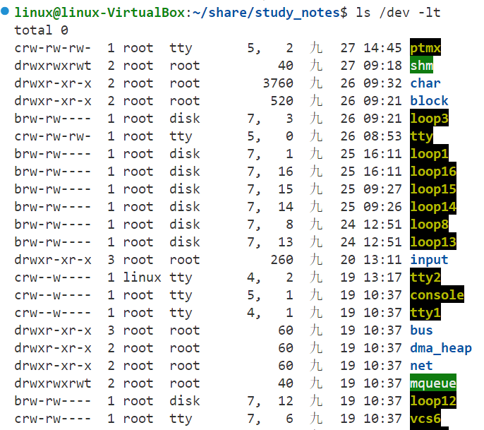
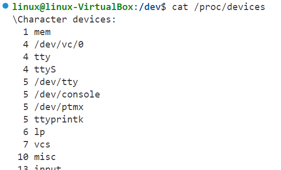
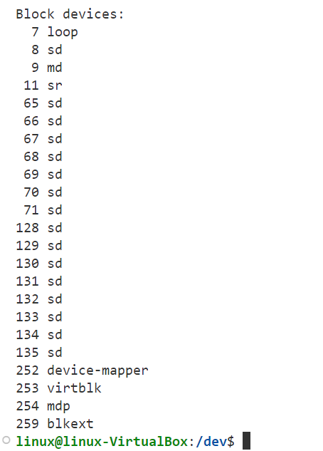

## Linux device driver types

------

Linux 的 device driver, 基本上分為三類

- Character devices (/dev/ttyS0, /dev/ttyusb1)
- Block devices (/dev/sda, /dev/mmc0block1)
- Network devices (無 /dev 下 node)

Linux 的 device driver 架構, 不一定限定控制 hardware, 也可以是 pseudo device

- Memory devices(/dev/loop0, /dev/ram0)
- Virtual devices (/dev/zero, /dev/null, /dev/full)

https://nanxiao.me/linux-kernel-note-20-device-major-minor-number/

## 设备的major和minor号

上面红框框起来的部分就是设备号，前面是`major`，后面是`minor`。 `major`号表示设备所使用的驱动，而`minor`号则表示具体的设备。在上图中，`loop`的驱动都是`driver 7`，而利用`minor`号区别不同的`tty`设备。另外，通过`/proc/devices`文件也可以看到设备所使用的驱动，即`major`号：

